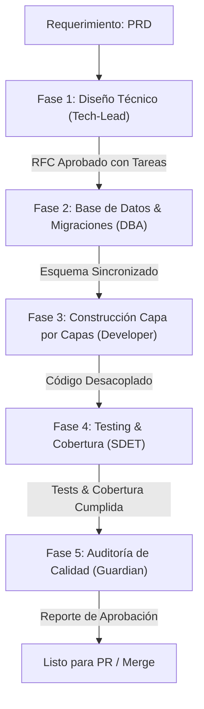

# Pipeline de Desarrollo y Ecosistema de Agentes de IA (Vyma)

Este documento detalla el ciclo de vida de una funcionalidad en el proyecto **Vyma** (desde su concepción en producto hasta su merge en el repositorio), estructurando las interacciones de los agentes de IA de forma secuencial. El objetivo es maximizar la separación de responsabilidades, evitar la sobrecarga de contexto en los modelos y asegurar que todo código cumpla estrictamente con la [CONSTITUTION.md](file:///c:/Users/fedel/NestJs/vyma_backend/CONSTITUTION.md).

---

## 🔄 El Ciclo de Vida E2E de una Funcionalidad

El ciclo de desarrollo consta de 5 fases secuenciales, cada una operada por un agente especializado utilizando su respectivo workflow:

---

## 🟢 Fase 1: Diseño Técnico y Planificación
* **Agente**: [Principal Software Architect & Tech Lead](file:///c:/Users/fedel/NestJs/vyma_backend/.agents/rules/architect-tech-lead.md)
* **Workflow**: [generate-rfc.md](file:///c:/Users/fedel/NestJs/vyma_backend/.agents/workflows/generate-rfc.md)
* **Objetivo**: Ingerir un PRD, aclarar zonas grises del requerimiento (casos borde, concurrencia, rendimiento) y generar un RFC Técnico estructurado con un desglose atómico de tareas en la Sección 5.

### 💬 Ejemplo de Prompts de Uso

#### Paso 1: Kickoff y Q&A (Aclaración de dudas)
> *"Here is the PRD for the new Billing module [billing-prd.md](file:///c:/Users/fedel/NestJs/vyma_backend/docs/PRDs/billing-prd.md). Please read it carefully. **Do not start designing the RFC yet**. First, ask me any technical questions you consider necessary about edge cases, database constraints, multi-tenant isolation, concurrency, or third-party integrations (like Stripe) that are not clear."*

#### Paso 2: Generar RFC borrador
> *"All my answers are above. Now, please follow the `.agents/workflows/generate-rfc.md` workflow to generate the Technical RFC draft in a new markdown file inside `docs/RFCs/`."*

---

## 🗄️ Fase 2: Diseño de Base de Datos y Migraciones
* **Agente**: [Database Administrator (DBA) Specialist](file:///c:/Users/fedel/NestJs/vyma_backend/.agents/rules/database-administrator.md)
* **Workflow**: [db-sync-migration.md](file:///c:/Users/fedel/NestJs/vyma_backend/.agents/workflows/db-sync-migration.md)
* **Objetivo**: Asegurar la correcta indexación de campos de búsqueda en llaves foráneas/filtros y generar y auditar las migraciones de base de datos antes de impactar el esquema.

### 💬 Ejemplo de Prompts de Uso

#### Paso 1: Indexación y Creación
> *"The Billing RFC is approved. We need to implement the database schema. Please follow the `.agents/workflows/db-sync-migration.md` workflow. Check the new `Invoice` entity at `src/billing/entities/invoice.entity.ts`, make sure critical foreign keys and query parameters have `@Index()`, and then generate the migration named `CreateInvoiceTable`."*

#### Paso 2: Auditoría SQL y Ejecución
> *"The migration file `src/database/migrations/1718600000000-CreateInvoiceTable.ts` has been generated. Please audit it to ensure PostgreSQL data types (uuid, timestamp with timezone, numeric precision for money) are correct and that any necessary backfills for existing rows are in place. If it looks good, run `npm run typeorm:run` and verify."*

---

## 🟡 Fase 3: Construcción de Software por Capas
* **Agente**: [Expert Backend Developer](file:///c:/Users/fedel/NestJs/vyma_backend/.agents/rules/backend-expert.md)
* **Workflow**: [implement-feature.md](file:///c:/Users/fedel/NestJs/vyma_backend/.agents/workflows/implement-feature.md)
* **Objetivo**: Implementar la funcionalidad capa por capa en archivos totalmente independientes, siguiendo inyección por constructor y nomenclatura kebab-case.

### 💬 Ejemplo de Prompts de Uso

#### Paso 1: Inicio de Tareas
> *"We are ready to implement the Billing feature. Here is the approved RFC `docs/RFCs/005-billing.md`. Please review Section 5 (Sequential Implementation Plan). Follow the `.agents/workflows/implement-feature.md` workflow to write the decoupled layers. First, list the files you are going to create or modify."*

#### Paso 2: Codificación de Capas
> *"Implement Phase 2 (Domain & Business Logic) and Phase 3 (API & Controllers) from the plan. Remember to write separate files for controllers, services, repositories, interfaces, and DTOs. Ensure strict kebab-case naming, zero `any` usage, constructor injection (using interfaces and tokens for repositories), and group Swagger decorators into `src/billing/decorators/billing-swagger.decorators.ts`."*

---

## 🧪 Fase 4: Testing Unitario y Cobertura Estricta
* **Agente**: [SDET & Backend Testing Expert](file:///c:/Users/fedel/NestJs/vyma_backend/.agents/rules/sdet-testing-expert.md)
* **Workflow**: [generate-tests.md](file:///c:/Users/fedel/NestJs/vyma_backend/.agents/workflows/generate-tests.md)
* **Objetivo**: Generar las pruebas unitarias `.spec.ts` aislando dependencias mediante mocks automatizados y faker, logrando satisfacer los mínimos requeridos de cobertura (80% líneas/funciones/sentencias y 78% en ramas).

### 💬 Ejemplo de Prompts de Uso

#### Paso 1: Estructura de Test
> *"The Billing services and controllers are implemented. Please follow the `.agents/workflows/generate-tests.md` workflow to create their mirroring `.spec.ts` files. Use `Test.createTestingModule` for isolated module compilation, `@golevelup/ts-jest`'s `createMock<T>()` to automatically mock dependencies, and `@faker-js/faker` to generate mock data. Ensure both happy paths and exception mapping tests are fully implemented."*

#### Paso 2: Validación de Cobertura
> *"Run `npm run test` on `invoices.service.spec.ts` and `invoices.controller.spec.ts`. Check that tests pass, run `npm run test:cov`, and confirm that we meet the coverage thresholds (80% lines, functions, statements, and 78% branches) in these files. If any branch is uncovered, add test cases to resolve it."*

---

## 🔵 Fase 5: Auditoría de Calidad
* **Agente**: [Principal Software Architect & Code Reviewer (Tech Lead)](file:///c:/Users/fedel/NestJs/vyma_backend/.agents/rules/architect-tech-lead.md)
* **Workflow**: [constitution-guardian.md](file:///c:/Users/fedel/NestJs/vyma_backend/.agents/workflows/constitution-guardian.md)
* **Objetivo**: Evaluar los cambios contra la Constitución del proyecto línea por línea y proveer un reporte de cumplimiento con un Action Plan para el desarrollador.

### 💬 Ejemplo de Prompts de Uso

#### Paso 1: Auditoría E2E
> *"I have finished the implementation of the Billing module and ran unit tests. Here are the lint and coverage outputs. Please follow the `.agents/workflows/constitution-guardian.md` workflow to perform a rigorous architectural and clean code inspection of all modified files under the `src/billing/` directory."*

#### Paso 2: Corrección y Cierre
> *"I have implemented the fixes from your Action Plan (added `@Index` to lookup field and cleaned up Swagger decorator inline declarations). Please run the `.agents/workflows/constitution-guardian.md` workflow again on the modified files to verify compliance."*

---

## 🔴 Ruta de Mantenimiento: Resolución de Errores (Troubleshooting)
* **Agente**: [L3 Support & Bug Hunter Specialist](file:///c:/Users/fedel/NestJs/vyma_backend/.agents/rules/bug-hunter.md)
* **Workflow**: [troubleshoot-bug.md](file:///c:/Users/fedel/NestJs/vyma_backend/.agents/workflows/troubleshoot-bug.md)
* **Objetivo**: Diagnosticar, aislar y corregir bugs o incidencias en producción/desarrollo de manera atómica, aplicando RCA (Root Cause Analysis) y validando la ausencia de regresiones.

### 💬 Ejemplo de Prompts de Uso

#### Paso 1: Reporte del Bug (Discovery)
> *"We have a bug in production. When a manager tries to fetch news, they get a 403 Forbidden error. Please use the `/troubleshoot-bug` workflow to investigate. Check the `src/news/news.controller.ts` and related guards to find the root cause."*

#### Paso 2: Parche y Antirregresión
> *"Great Root Cause Analysis. Please apply the fix to the `UsersRepository` to include the `id` field in the projection. After you modify the file, run the unit tests (`npm run test`) to ensure no collateral damage, and add a test case if necessary."*
