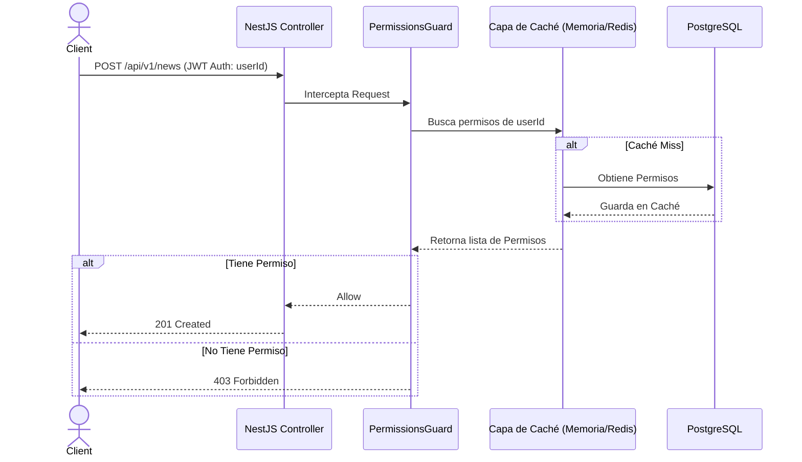

# RFC-002: Sistema de Roles y Permisos (RBAC Dinámico)

**Estado:** `APROBADO`
**Módulo:** `Auth` / `Users`

Este documento detalla la propuesta técnica para migrar el sistema actual de autorización (basado en un Enum estático de Roles) hacia un sistema granular de Roles y Permisos, compatible con la implementación existente de `@nestjs/passport` y JWT.

---

## 1. Título y Contexto

* **Funcionalidad:** Gestión dinámica de Roles y Permisos (RBAC - Role-Based Access Control).
* **Objetivo de Negocio:** Permitir asignar permisos específicos a roles (ej. `CREATE_NEWS`, `DELETE_USERS`) y que los administradores puedan crear nuevos roles o ajustar permisos desde el panel Next.js sin requerir despliegues del código.
* **Problema que Resuelve:** Actualmente la entidad `User` tiene un Enum duro (`client`, `professional`, `admin`). Esto no escala si en el futuro se necesita un rol "Editor" que pueda crear noticias pero no borrar usuarios.

---

## 2. Propuesta Arquitectónica

Se propone adoptar un modelo **RBAC dinámico en base de datos** acoplado a una **estrategia de Caché** para validación rápida.

### Decisiones de Arquitectura Acordadas
1. **Un solo rol por usuario:** Relación `ManyToOne` (Usuario a Rol). Es escalable si a futuro se requiere `ManyToMany`.
2. **Validación vía Caché (JWT Ligero):** Para evitar que el JWT se vuelva excesivamente grande ("bloat") y permitir la **revocación instantánea** de permisos, el JWT solo almacenará el `userId`. El `PermissionsGuard` (o el `JwtStrategy`) consultará una capa de Caché para obtener el rol y los permisos del usuario. Si no están en caché, los buscará en la BD y los guardará en Caché.
3. **Reset de Datos:** No se generarán scripts complejos de migración; se hará un borrado de esquema y un Seeder inicial poblará los nuevos roles y permisos.

### Flujo de Autorización
1. **Login:** El servidor firma un JWT que **solo** incluye `{ id: userId }`.
2. **Caché:** En la primera petición protegida, el sistema busca los permisos en caché (`permissions_user_123`). Si no existen, los extrae de PostgreSQL y los guarda en Caché con un TTL (Time-To-Live).
3. **Guards:** Se usará `@RequirePermissions('create:news')` en los controladores.
4. **Verificación:** El `PermissionsGuard` validará contra la lista de permisos recuperada del caché.



---

## 3. Modelo de Datos (TypeORM)

```typescript
// Role Entity
@Entity('roles')
export class Role {
  @PrimaryGeneratedColumn('increment')
  id: number;

  @Column({ unique: true })
  name: string; // ej. 'admin', 'professional', 'client'

  // Relación ManyToMany con Permisos
  @ManyToMany(() => Permission)
  @JoinTable({ name: 'role_permissions' })
  permissions: Permission[];
}

// Permission Entity
@Entity('permissions')
export class Permission {
  @PrimaryGeneratedColumn('increment')
  id: number;

  @Column({ unique: true })
  action: string; // ej. 'create:news', 'read:users'
}

// Modificación en User Entity
@Entity('users')
export class User {
  // ... campos actuales ...
  
  @ManyToOne(() => Role)
  @JoinColumn({ name: 'role_id' })
  role: Role; 
}
```

---

## 4. Diseño de la API (Contratos y DTOs)

Se requerirán endpoints administrativos para gestionar los roles y asignarlos:

* `GET /api/v1/roles` -> Lista todos los roles y sus permisos.
* `POST /api/v1/roles` -> Crea un nuevo rol.
* `PUT /api/v1/roles/:id` -> Actualiza el rol y sus permisos.
* `GET /api/v1/permissions` -> Lista todos los permisos disponibles en el sistema.
