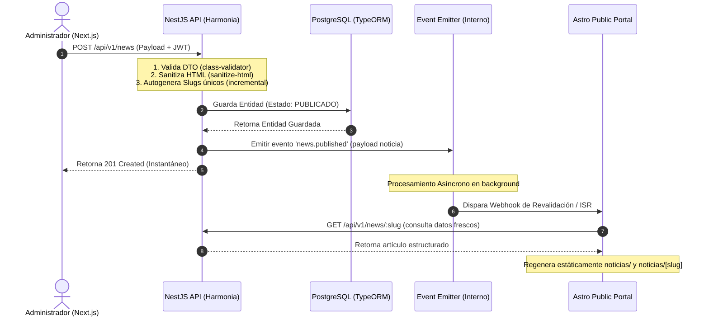

# RFC-001: Sistema de Noticias y Publicaciones (Ecosistema Completo)

Este documento detalla la propuesta técnica para implementar el sistema de Noticias y Publicaciones dinámico de la Cámara de Comercio Paraguayo-Suiza (CCPS), definiendo los contratos de API, el modelo de datos en PostgreSQL con TypeORM, y la integración asíncrona mediante eventos para la invalidación de caché (ISR) en el portal público.

---

## 1. Título y Contexto

* **Funcionalidad:** Sistema de Noticias y Publicaciones (Módulo `News`).
* **Objetivo de Negocio:** Permitir a los administradores de la CCPS gestionar de manera autónoma, robusta y bilingüe (español/inglés) artículos, comunicados y novedades desde un panel administrativo Next.js. Las publicaciones se persisten en la base de datos centralizada de NestJS y se propagan eficientemente al portal público Astro mediante regeneración estática basada en webhooks (ISR).
* **Problema que Resuelve:** Cierra el circuito del portal web proporcionando APIs REST de alto rendimiento y alta seguridad, garantizando consistencia bilingüe obligatoria al publicar, sanitización frente a vulnerabilidades XSS en el HTML estructurado, y tiempos de carga instantáneos en la web pública.

---

## 2. Propuesta Arquitectónica

El backend de NestJS actuará como el orquestador principal. Para mantener la velocidad y escalabilidad de la API administrativa sin bloquear la experiencia del usuario, adoptaremos una **arquitectura basada en eventos (Event-Driven Architecture)** mediante el `EventEmitter` nativo de NestJS para notificar externamente a Astro la publicación o modificación de contenido de forma asíncrona.

### Flujo de Datos y Eventos
1. **Creación/Edición:** El panel Next.js envía la información al backend autenticado con JWT y protegido para administradores (`admin`).
2. **Validación y Sanitización:** El backend sanitiza el HTML en el DTO de entrada antes de guardarlo en PostgreSQL.
3. **Persistencia:** Se guarda en la base de datos y, si cambia el estado a `PUBLICADO` o se modifica una noticia publicada, se emite un evento interno.
4. **Invalidación Asíncrona (Astro Webhook):** Un Event Listener en NestJS captura el evento y ejecuta una petición HTTP (webhook) al portal Astro en segundo plano para activar el prerenderizado (ISR) del nuevo detalle y del listado general, evitando latencias síncronas en la API de administración.



---

## 3. Modelo de Datos (Database Schema)

Crearemos la tabla `news` y la relacionaremos con el administrador (`users`). Se aplicará **Soft-Delete** para evitar la pérdida accidental de datos y asegurar auditabilidad.

### Entidad TypeORM: `News` (`src/news/entities/news.entity.ts`)

```typescript
import {
  Entity,
  PrimaryGeneratedColumn,
  Column,
  CreateDateColumn,
  UpdateDateColumn,
  DeleteDateColumn,
  ManyToOne,
  JoinColumn,
  Index,
} from 'typeorm';
import { User } from '../../auth/entities/user.entity';

export enum NewsCategory {
  NOTICIA = 'NOTICIA',
  COMUNICADO = 'COMUNICADO',
  EVENTO_SOCIO = 'EVENTO_SOCIO',
}

export enum NewsStatus {
  BORRADOR = 'BORRADOR',
  PUBLICADO = 'PUBLICADO',
}

@Entity('news')
export class News {
  @PrimaryGeneratedColumn('uuid')
  id: string;

  @Index({ unique: true })
  @Column('varchar', { length: 255, unique: true })
  slugEs: string;

  @Index({ unique: true })
  @Column('varchar', { length: 255, unique: true })
  slugEn: string;

  @Column('varchar', { length: 255 })
  tituloEs: string;

  @Column('varchar', { length: 255, nullable: true })
  tituloEn: string | null;

  @Column('text')
  resumenEs: string;

  @Column('text', { nullable: true })
  resumenEn: string | null;

  @Column('text', { comment: 'Almacena HTML enriquecido sanitizado' })
  contenidoEs: string;

  @Column('text', { nullable: true, comment: 'Almacena HTML enriquecido sanitizado bilingüe' })
  contenidoEn: string | null;

  @Column('varchar', { length: 500, comment: 'Cloudinary URL' })
  imagenPortada: string;

  @Column({
    type: 'enum',
    enum: NewsCategory,
    default: NewsCategory.NOTICIA,
  })
  categoria: NewsCategory;

  @Column({
    type: 'enum',
    enum: NewsStatus,
    default: NewsStatus.BORRADOR,
  })
  estado: NewsStatus;

  @Column('bigint', { name: 'autor_id' })
  autorId: number;

  @ManyToOne(() => User, { onDelete: 'RESTRICT' })
  @JoinColumn({ name: 'autor_id' })
  autor: User;

  @CreateDateColumn({ type: 'timestamp' })
  createdAt: Date;

  @UpdateDateColumn({ type: 'timestamp' })
  updatedAt: Date;

  @DeleteDateColumn({ type: 'timestamp', nullable: true })
  deletedAt: Date | null;
}
```

### Índices de Rendimiento Propuestos:
1. `IDX_news_slug_es`: Índice único sobre `slugEs` para búsquedas inmediatas en español en el portal público.
2. `IDX_news_slug_en`: Índice único sobre `slugEn` para búsquedas inmediatas en inglés en el portal público.
3. `IDX_news_filter`: Índice compuesto `@Index(['estado', 'categoria', 'deletedAt'])` para optimizar el listado público paginado de noticias activas.

---

## 4. Diseño de la API (Contratos y DTOs)

### Endpoints REST

| Método | Ruta | Acceso | Propósito |
|---|---|---|---|
| **GET** | `/api/v1/news` | Público | Retorna noticias paginadas en estado `PUBLICADO`. |
| **GET** | `/api/v1/news/:slug` | Público | Obtiene el detalle de una noticia por `slugEs` o `slugEn` (solo si está `PUBLICADO`). |
| **GET** | `/api/v1/news/admin` | Protected (`admin`) | Lista todas las noticias (Borradores y Publicados) con filtros extendidos. |
| **POST** | `/api/v1/news` | Protected (`admin`) | Crea una nueva noticia en borrador o publicada. |
| **PUT** | `/api/v1/news/:id` | Protected (`admin`) | Actualiza una noticia por ID. |
| **DELETE** | `/api/v1/news/:id` | Protected (`admin`) | Aplica Soft-Delete a una noticia por ID. |

---

### DTOs de Entrada y Reglas de Validación

Utilizaremos `class-validator` y `class-transformer` para validar el payload y asegurar la sanitización XSS mediante la integración de la librería `sanitize-html` en un decorador de transformación personalizado `@SanitizeHtml()`.

#### Custom Decorator de Sanitización: `src/common/decorators/sanitize-html.decorator.ts`
```typescript
import { Transform } from 'class-transformer';
import * as sanitizeHtml from 'sanitize-html';

export function SanitizeHtml() {
  return Transform(({ value }) => {
    if (typeof value !== 'string') return value;
    return sanitizeHtml(value, {
      allowedTags: [
        'h1', 'h2', 'h3', 'h4', 'h5', 'h6', 'blockquote', 'p', 'a', 'ul', 'ol',
        'nl', 'li', 'b', 'i', 'strong', 'em', 'strike', 'code', 'hr', 'br', 'div',
        'table', 'thead', 'caption', 'tbody', 'tr', 'th', 'td', 'pre', 'img'
      ],
      allowedAttributes: {
        'a': ['href', 'name', 'target'],
        'img': ['src', 'alt', 'title', 'width', 'height', 'loading']
      },
      selfClosing: ['img', 'br', 'hr', 'area'],
      allowedSchemes: ['http', 'https', 'mailto']
    });
  });
}
```

#### DTO de Creación: `src/news/dto/create-news.dto.ts`
Implementa la **Regla de Negocio 2** (i18n obligatoria en `PUBLICADO`) usando `@ValidateIf`.

```typescript
import {
  IsString,
  IsEnum,
  IsUrl,
  IsNotEmpty,
  IsOptional,
  ValidateIf,
  MaxLength
} from 'class-validator';
import { NewsCategory, NewsStatus } from '../entities/news.entity';
import { SanitizeHtml } from '../../common/decorators/sanitize-html.decorator';

export class CreateNewsDto {
  @IsString()
  @IsNotEmpty({ message: 'El título en español es obligatorio.' })
  @MaxLength(255)
  tituloEs: string;

  @IsString()
  @IsNotEmpty({ message: 'El resumen en español es obligatorio.' })
  resumenEs: string;

  @IsString()
  @IsNotEmpty({ message: 'El contenido en español es obligatorio.' })
  @SanitizeHtml()
  contenidoEs: string;

  @IsUrl({}, { message: 'Debe proporcionar una URL válida de Cloudinary para la portada.' })
  @IsNotEmpty({ message: 'La imagen de portada es obligatoria.' })
  imagenPortada: string;

  @IsEnum(NewsCategory, { message: 'Categoría no válida.' })
  categoria: NewsCategory;

  @IsEnum(NewsStatus, { message: 'Estado no válido.' })
  estado: NewsStatus;

  // --- Validación Condicional para i18n cuando se desea publicar ---
  
  @ValidateIf(o => o.estado === NewsStatus.PUBLICADO)
  @IsString({ message: 'Al publicar, el título en inglés es obligatorio.' })
  @IsNotEmpty({ message: 'Al publicar, el título en inglés no puede estar vacío.' })
  @MaxLength(255)
  tituloEn?: string;

  @ValidateIf(o => o.estado === NewsStatus.PUBLICADO)
  @IsString({ message: 'Al publicar, el resumen en inglés es obligatorio.' })
  @IsNotEmpty({ message: 'Al publicar, el resumen en inglés no puede estar vacío.' })
  resumenEn?: string;

  @ValidateIf(o => o.estado === NewsStatus.PUBLICADO)
  @IsString({ message: 'Al publicar, el contenido en inglés es obligatorio.' })
  @IsNotEmpty({ message: 'Al publicar, el contenido en inglés no puede estar vacío.' })
  @SanitizeHtml()
  contenidoEn?: string;
}
```

#### DTO de Paginación Pública: `src/news/dto/news-pagination.dto.ts`
```typescript
import { IsOptional, IsEnum, IsInt, Min, Max } from 'class-validator';
import { Type } from 'class-transformer';
import { NewsCategory } from '../entities/news.entity';

export class NewsPaginationDto {
  @IsOptional()
  @Type(() => Number)
  @IsInt()
  @Min(1)
  page?: number = 1;

  @IsOptional()
  @Type(() => Number)
  @IsInt()
  @Min(1)
  @Max(50)
  limit?: number = 10;

  @IsOptional()
  @IsEnum(NewsCategory)
  categoria?: NewsCategory;
}
```

---

## 5. Consideraciones de Seguridad y Rendimiento

### Seguridad
* **Autenticación e Identidad:** Todos los endpoints de administración utilizarán `@UseGuards(AuthGuard('jwt'), UserRoleGuard)` y `@RoleProtected(ValidRoles.admin)`. El `autorId` se recuperará inyectando el decorador `@GetUser()` que lee el payload decodificado en `req.user` para persistir la autoría de forma confiable.
* **XSS Protection:** El HTML enriquecido proveniente del editor WYSIWYG se limpiará en el DTO usando la librería `sanitize-html` en el backend antes de insertarse en la base de datos PostgreSQL, blindando el portal contra inyecciones maliciosas de scripts, eventos de imagen (`onload`, `onerror`), etc.

### Rendimiento y Concurrencia
* **Estrategia de Slugs Incrementales (Opción B):** Para resolver colisiones, el servicio ejecutará una validación ágil:
  1. Convierte el título a un slug básico (`slugify`).
  2. Consulta la base de datos usando `LIKE 'slug-basico%'` o igualdad simple.
  3. Si existe colisión, consulta el mayor contador asignado a ese prefijo y añade el sufijo `-N+1` de manera automática en una transacción de TypeORM.
* **Integración de Webhooks sin Bloqueo:** El trigger de actualización de Astro (ISR) se ejecuta en segundo plano. Cuando el controlador finaliza con éxito la mutación de datos en PostgreSQL, emite el evento y retorna inmediatamente un código `200` o `201` al panel Next.js. El `AstroWebhookListener` manejará la petición HTTP externamente de forma asíncrona mediante un bloque `try/catch` aislado, previniendo que problemas de red externos de Astro afecten los tiempos de respuesta de la API interna.
* **Desacoplamiento de WhatsApp:** Este PRD no requiere envío directo de WhatsApp, pero si en fases posteriores se desea notificar a un canal de comunicación o a los socios, se puede añadir un nuevo Listener al evento `news.published` sin modificar la lógica del servicio principal de noticias.

---

## 6. Plan de Implementación

Este checklist servirá de guía detallada para el desarrollo ordenado en NestJS:

- [ ] **Paso 1: Instalación de Dependencias**
  * Instalar `sanitize-html` y sus tipos de desarrollo:
    ```bash
    npm install sanitize-html
    npm install --save-dev @types/sanitize-html
    ```
- [ ] **Paso 2: Generar Módulo Skeleton**
  * Crear la estructura usando Nest CLI:
    ```bash
    nest g mo news
    nest g s news
    nest g co news
    ```
- [ ] **Paso 3: Definir Esquema y Enums**
  * Crear `src/news/entities/news.entity.ts` definiendo las propiedades, enums, índices y relaciones con `User` utilizando TypeORM.
- [ ] **Paso 4: Implementar Decorador de Sanitización y Helper de Slugify**
  * Crear `src/common/decorators/sanitize-html.decorator.ts`.
  * Desarrollar una función utilitaria en `src/common/helpers/slugify.helper.ts` para limpiar caracteres especiales y acentos.
- [ ] **Paso 5: Crear DTOs de Validación**
  * Implementar `CreateNewsDto`, `UpdateNewsDto` (heredando con `PartialType`) y `NewsPaginationDto` con sus respectivas reglas en `src/news/dto/`.
- [ ] **Paso 6: Lógica de Servicio (`NewsService`)**
  * Implementar generación de slug con prevención de colisiones incrementales (Opción B).
  * Crear método `create` (asigna `autorId` del JWT, autogenera `slugEs` y `slugEn`, maneja validaciones condicionales de i18n).
  * Crear método `findAll` público (retorna noticias paginadas y filtradas que estén únicamente `PUBLICADO`).
  * Crear método `findAllAdmin` (retorna borradores, publicados, soporte de búsqueda).
  * Crear método `findOneBySlug` público (busca en `slugEs` o `slugEn` con estado `PUBLICADO`).
  * Crear método `update` (valida i18n si pasa a `PUBLICADO`, actualiza slugs si cambian títulos y aún era borrador).
  * Crear método `remove` utilizando `softDelete` de TypeORM.
- [ ] **Paso 7: Arquitectura de Eventos**
  * Crear `src/news/events/news-published.event.ts` y registrar el `EventEmitterModule` en NestJS si no está activo.
  * Diseñar el Listener `src/news/listeners/astro-webhook.listener.ts` que escuche `news.published`, `news.updated` y `news.deleted` para disparar la llamada al webhook de Astro ISR.
- [ ] **Paso 8: Configurar Controlador (`NewsController`)**
  * Mapear los endpoints REST públicos.
  * Mapear los endpoints administrativos configurando `@UseGuards(AuthGuard('jwt'), UserRoleGuard)` y `@RoleProtected(ValidRoles.admin)`.
- [ ] **Paso 9: Generación de Migración**
  * Generar el archivo de migración de base de datos oficial mediante TypeORM CLI:
    ```bash
    npm run typeorm:generate -- name=CreateNewsTable
    ```
  * Correr las migraciones para validar que impacte correctamente en PostgreSQL:
    ```bash
    npm run typeorm:run
    ```
- [ ] **Paso 10: Pruebas Unitarias**
  * Validar la lógica de incremento de slugs, sanitización de DTOs y restricciones de publicación bilingüe en `news.service.spec.ts`.

---

## 7. Preguntas Abiertas (Open Questions)

*Las aclaraciones del kickoff Q&A han sido consolidadas satisfactoriamente en este diseño:*
* ✔ **Cloudinary:** Las imágenes se subirán directamente desde Next.js a Cloudinary y el backend únicamente persistirá la URL en formato texto.
* ✔ **Colisiones:** Se resolvió utilizar un contador incremental numérico para resolver colisiones de slugs de forma automática.
* ✔ **Sanitización:** Se ejecutará a nivel de DTO (Opción A) mediante `sanitize-html` en el transform de `class-transformer`.
* ✔ **Astro Caché:** No requiere almacenamiento en caché del lado del backend NestJS dado que el portal utilizará Prerenderizado (ISR) gatillado asíncronamente por el webhook del backend, y Next.js implementará caching de cliente mediante React Query.
