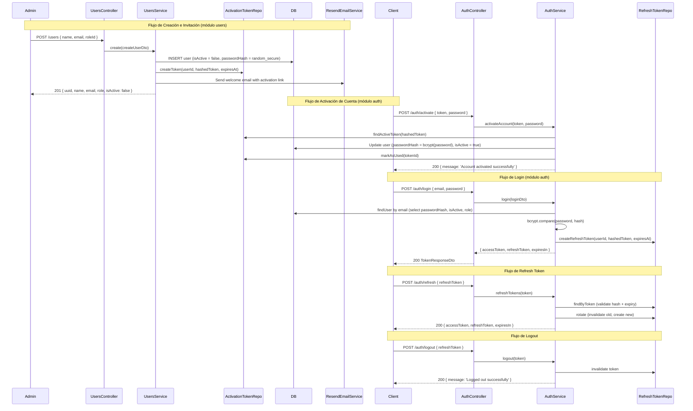

# RFC: Refactor del Módulo de Autenticación (RFC-003)

**Fecha:** 2026-06-10
**Autor:** Arquitecto Tech Lead (Vyma)
**Estado:** Draft

---

## 1. Propuesta Arquitectónica

### Justificación

El módulo `auth` actual mezcla responsabilidades: gestiona tanto el **registro** de usuarios como el **login**. Esto viola el principio de Responsabilidad Única (SRP) y contradice la intención de que los usuarios sean administrados exclusivamente por el módulo `users` (ABM completo).

Adicionalmente, el sistema de tokens actual presenta vulnerabilidades: emite un único access token de larga duración (`2h`) sin mecanismo de revocación ni soporte para refresh tokens, lo que expone la sesión ante robo de credenciales.

**Decisiones de diseño:**
1. El **módulo `users`** absorbe la responsabilidad del alta de usuarios (requiere `name`, `email`, `roleId` obligatorios). El usuario se crea inactivo (`isActive = false`) y con un hash de contraseña temporal aleatorio.
2. Se implementa un **flujo de invitación**: se genera un token de activación seguro y se envía un link por email al usuario via Resend. El usuario activa su cuenta y define su contraseña en el endpoint de activación.
3. El **módulo `auth`** queda exclusivamente orientado a autenticación y sesión: `login`, `refresh`, `logout` y `activate`.
4. Se introduce una entidad `RefreshToken` para gestión segura del ciclo de vida de sesiones.
5. Se introduce una entidad `ActivationToken` para gestionar de forma segura el ciclo de activación de cuentas.
6. Se aplica rate limiting estricto en todos los endpoints de autenticación y activación.

### Diagrama de Flujo



---

## 2. Modelo de Datos (TypeORM Schema)

### 2.1 Modificaciones a la Entidad `User`

La entidad `User` existente **no requiere cambios en sus columnas**. Sin embargo, se debe reforzar la lógica de creación para exigir `name`, `email`, y `roleId` como campos obligatorios en el DTO del módulo `users`.

Los campos `accessToken`, `refreshToken`, `tokenExpiry` del `User` actual son columnas del proveedor OAuth (provider externo: google, github, etc.). **No se usarán para los refresh tokens internos**, ya que estos tendrán su propia tabla.

### 2.2 Nueva Entidad: `RefreshToken`

```typescript
// src/auth/entities/refresh-token.entity.ts

@Entity('refresh_tokens')
export class RefreshToken {
  @PrimaryGeneratedColumn('increment', { type: 'bigint' })
  id: number;

  @Column()
  @Generated('uuid')
  @Index({ unique: true })
  uuid: string;

  @Column('text', { comment: 'Token hasheado con bcrypt' })
  tokenHash: string;

  @Column('timestamp')
  @Index()
  expiresAt: Date;

  @Column('boolean', { default: false })
  isRevoked: boolean;

  @Column('varchar', { length: 255, nullable: true, comment: 'IP de origen del login' })
  ipAddress: string | null;

  @Column('text', { nullable: true, comment: 'User-Agent del cliente' })
  userAgent: string | null;

  @CreateDateColumn({ type: 'timestamp' })
  createdAt: Date;

  @ManyToOne(() => User, { onDelete: 'CASCADE' })
  @JoinColumn({ name: 'user_id' })
  user: User;
}
```

**Índices propuestos:**
- `expiresAt`: Para purgas periódicas de tokens expirados.
- `uuid`: Para lookups por token.
- FK `user_id`: Para invalidación masiva por usuario.

### 2.3 Nueva Entidad: `ActivationToken`

```typescript
// src/users/entities/activation-token.entity.ts

@Entity('activation_tokens')
export class ActivationToken {
  @PrimaryGeneratedColumn('increment', { type: 'bigint' })
  id: number;

  @Column('text', { comment: 'Token de activación hasheado con bcrypt' })
  tokenHash: string;

  @Column('timestamp')
  @Index()
  expiresAt: Date;

  @Column('boolean', { default: false })
  isUsed: boolean;

  @CreateDateColumn({ type: 'timestamp' })
  createdAt: Date;

  @OneToOne(() => User, { onDelete: 'CASCADE' })
  @JoinColumn({ name: 'user_id' })
  user: User;
}
```

### 2.4 DTO de Creación de Usuario (módulo `users`)

```typescript
// src/users/dto/create-user.dto.ts
export class CreateUserDto {
  @IsString()
  @IsNotEmpty()
  @MinLength(2)
  @MaxLength(255)
  name: string;

  @IsEmail()
  @IsNotEmpty()
  email: string;

  @IsInt()
  @IsPositive()
  roleId: number;  // Obligatorio. Se busca el Role por ID y se asigna.
}
```

> **Nota:** El `password` inicial puede ser auto-generado por el sistema (UUID aleatorio) y enviado por email con Resend, o bien el administrador lo puede setear en la creación. Esto queda a definir en el task breakdown.

---

## 3. Diseño de API y Contratos

### 3.1 Módulo `users` — Endpoint de Creación

| Método | Ruta | Guard | Roles | Descripción |
|--------|------|-------|-------|-------------|
| `POST` | `/users` | `JwtAuthGuard`, `RolesGuard` | `admin`, `superadmin` | Crea un nuevo usuario con nombre, email y rol |

**Request DTO:**
```json
{
  "name": "Federico López",
  "email": "fede@example.com",
  "roleId": 2
}
```

**Response (201):**
```json
{
  "uuid": "a1b2c3d4-...",
  "name": "FEDERICO LÓPEZ",
  "email": "fede@example.com",
  "isActive": false,
  "role": { "id": 2, "name": "operator" },
  "createdAt": "2026-06-10T15:00:00Z"
}
```

---

### 3.2 Módulo `auth` — Endpoints

| Método | Ruta | Guard | Rate Limit | Descripción |
|--------|------|-------|------------|-------------|
| `POST` | `/auth/activate` | Público | **3 req / 60s** | Activa la cuenta definiendo la contraseña inicial |
| `POST` | `/auth/login` | Público | **5 req / 60s** | Login con email y password |
| `POST` | `/auth/refresh` | Público | 10 req / 60s | Obtiene nuevos tokens via refresh token |
| `POST` | `/auth/logout` | `JwtAuthGuard` | — | Invalida el refresh token activo |

#### `POST /auth/activate`

**Request DTO (`ActivateAccountDto`):**
```json
{
  "token": "raw-uuid-activation-token-here",
  "password": "my-new-secure-password"
}
```

**Response (200):**
```json
{
  "message": "Account activated successfully"
}
```

#### `POST /auth/login`

**Request DTO (`LoginDto`):**
```json
{
  "email": "fede@example.com",
  "password": "my-password"
}
```

**Response (200 - `TokenResponseDto`):**
```json
{
  "accessToken": "eyJhbGci...",
  "refreshToken": "d3f4a1b2c3...",
  "expiresIn": 900,
  "user": {
    "uuid": "a1b2c3d4-...",
    "name": "FEDERICO LÓPEZ",
    "email": "fede@example.com",
    "role": "operator"
  }
}
```

#### `POST /auth/refresh`

**Request DTO (`RefreshTokenDto`):**
```json
{
  "refreshToken": "d3f4a1b2c3..."
}
```

**Response (200 - `TokenResponseDto`):** *(mismo formato que login)*

#### `POST /auth/logout`

**Request Header:** `Authorization: Bearer <accessToken>`
**Request Body:** `{ "refreshToken": "d3f4a1b2c3..." }`
**Response (200):** `{ "message": "Logged out successfully" }`

---

### 3.3 Interfaz `JwtPayload` (Actualizada)

```typescript
// src/auth/interfaces/jwt-payload.interface.ts
export interface JwtPayload {
  sub: number;        // user.id (estándar JWT claim)
  uuid: string;       // user.uuid para respuestas públicas
  email: string;
  role: string;       // nombre del rol para autorización rápida
  iat?: number;       // issued at (manejado por jwtService)
}
```

> **Seguridad:** El payload nunca incluye `passwordHash`, datos de perfil, ni información sensible.

---

## 4. Consideraciones de Seguridad y Performance

### 4.1 Tokens y Ciclo de Vida

| Token | Duración | Almacenamiento cliente | Mecanismo |
|-------|----------|----------------------|-----------|
| Access Token (JWT) | **15 minutos** | Memory / `Authorization` header | JWT firmado con `JWT_SECRET` |
| Refresh Token | **7 días** | HttpOnly Cookie **o** body (elegir según arquitectura cliente) | UUID aleatorio, almacenado hasheado en DB |

**Rotación de Refresh Tokens:** Cada vez que se usa un refresh token para obtener nuevos tokens, el token anterior se invalida (`isRevoked = true`) y se genera uno nuevo. Si un token ya revocado es usado, se invalidan **todos los tokens activos** del usuario (posible robo de token detectado).

### 4.2 Rate Limiting (brute-force protection)

```
POST /auth/login     → @Throttle({ login: { limit: 5, ttl: 60000 } })
POST /auth/refresh   → @Throttle({ refresh: { limit: 10, ttl: 60000 } })
```

### 4.3 Configuración JWT (Reforzada)

```typescript
JwtModule.registerAsync({
  useFactory: (config: ConfigService) => ({
    secret: config.get<string>('JWT_SECRET'),  // Desde .env, mínimo 32 chars
    signOptions: {
      expiresIn: '15m',       // Reducido de 2h → 15m
      issuer: config.get<string>('JWT_ISSUER'),
      audience: config.get<string>('JWT_AUDIENCE'),
    },
  }),
})
```

**Variables de entorno requeridas (nuevas):**
```
JWT_SECRET=<min 32 chars random string>
JWT_ISSUER=vyma-api
JWT_AUDIENCE=vyma-client
JWT_REFRESH_EXPIRES_DAYS=7
```

### 4.4 Validación en JwtStrategy (Actualizada)

- Verificar que el usuario exista **y esté activo** en cada request protegido.
- Verificar `issuer` y `audience` del token para prevenir ataques de confusión.

### 4.5 Purga de Refresh Tokens Expirados

Se implementará un job programado (`@Cron`) en el propio módulo auth para limpiar tokens expirados y revocados de la tabla `refresh_tokens` periódicamente (ej. cada noche a las 3 AM).

---

## 5. Plan de Implementación Secuencial

### Fase 1: Database & Entidades
- [x] 1.1 Crear entidad `RefreshToken` (`src/auth/entities/refresh-token.entity.ts`)
- [x] 1.2 Crear entidad `ActivationToken` (`src/users/entities/activation-token.entity.ts`)
- [x] 1.3 Registrar entidades en sus respectivos módulos (`AuthModule` y `UsersModule`)
- [x] 1.4 Generar y ejecutar migración TypeORM para las tablas `refresh_tokens` y `activation_tokens`
- [x] 1.5 **[Test]** Crear pruebas unitarias para validar las entidades y asegurar que la migración corre correctamente en entornos de pruebas

### Fase 2: Módulo `users` (Creación e Invitación)
- [x] 2.1 Crear `CreateUserDto` en `src/users/dto/create-user.dto.ts` (name, email, roleId obligatorios)
- [x] 2.2 Crear repositorio y servicio para gestionar `ActivationToken` en el módulo `users`
- [x] 2.3 Extender `UsersService.create()` para:
  - Crear el usuario con `isActive: false` y un password hash aleatorio seguro
  - Generar el token de activación, hashearlo y guardarlo en la tabla `activation_tokens`
- [x] 2.4 Crear `UsersController` con `POST /users` protegido por `JwtAuthGuard` + `RolesGuard(['admin', 'superadmin'])`
- [x] 2.5 **[Test]** Crear pruebas unitarias de `UsersService.create()` y `UsersController` (validar guardado inactivo, generación de token e integridad de roles)

### Fase 3: Refactor y Activación en módulo `auth`
- [x] 3.1 Eliminar `POST /auth/register` del `AuthController` y remover `registerWithProfile()` del `AuthService`
- [x] 3.2 Implementar el endpoint `POST /auth/activate` y el método `AuthService.activateAccount()` que:
  - Busque y valide el token de activación (sin usar y no expirado)
  - Actualice la contraseña del usuario con bcrypt
  - Cambie `isActive` a `true`
  - Invalide el token de activación usado (`isUsed = true`)
- [x] 3.3 **[Test]** Crear pruebas unitarias de `AuthService.activateAccount()` (casos de éxito, expiración, token usado y token inválido)
- [x] 3.4 Actualizar `JwtPayload` interface con los nuevos campos (`sub`, `uuid`, `email`, `role`)
- [x] 3.5 Actualizar `AuthService.login()` para:
  - Emitir access token de **15m**
  - Generar y almacenar refresh token hasheado en `refresh_tokens`
  - Capturar IP y User-Agent del request
  - Retornar `TokenResponseDto`
- [x] 3.6 Implementar `AuthService.refreshTokens(token: string)` con rotación automática y detección de robo
- [x] 3.7 Implementar `AuthService.logout(token: string, userId: number)` para revocar el refresh token
- [x] 3.8 Actualizar `JwtStrategy.validate()` con validación de `issuer`, `audience` y estado del usuario (`isActive`)
- [x] 3.9 Configurar `ThrottlerModule` con límites específicos para auth endpoints (login, refresh, activate)
- [x] 3.10 **[Test]** Crear pruebas unitarias de login, refresh, logout, estrategia JWT y guards

### Fase 4: Events, Integrations & Cron Jobs
- [x] 4.1 Crear listener `UserCreatedListener` en `src/users/listeners/` para capturar el evento y enviar email de bienvenida con el enlace de activación via Resend
- [x] 4.2 **[Test]** Crear pruebas unitarias del listener con mocks del servicio de correo Resend
- [x] 4.3 Implementar `@Cron` en `AuthModule` para purga periódica de tokens expirados en `refresh_tokens` y `activation_tokens`
- [x] 4.4 **[Test]** Crear pruebas unitarias para validar el job de purga cron

### Fase 5: E2E & Verificación Manual
- [x] 5.1 **[Test]** Crear suite de pruebas E2E que cubra el flujo de invitación completo: creación → activación con token → login → refresh token → logout
- [x] 5.2 Verificar rate limiting en login (>5 intentos/min → 429) y activación (>3 intentos/min → 429)
- [x] 5.3 Verificar que un refresh token revocado invalida toda la sesión del usuario
- [x] 5.4 Verificar que tokens expirados devuelven 401
- [x] 5.5 Documentar variables de entorno en `.env.example`

---

## 6. Definition of Done (DoD)

Para considerar el refactor del módulo de autenticación como **Completado**, se deben cumplir los siguientes criterios:

### 1. Requisitos de Funcionalidad
- El registro público está deshabilitado. Solo los administradores pueden crear usuarios (`POST /users`).
- El usuario creado se inicializa como inactivo (`isActive = false`) y recibe por email un link de activación único.
- El usuario puede activar su cuenta y definir su password en `/auth/activate` utilizando su token.
- El login genera un `accessToken` corto (15 min) y un `refreshToken` largo (7 días) guardado en la base de datos de manera hasheada.
- Se soporta rotación de refresh tokens y detección de uso de tokens revocados.
- El logout revoca de forma segura la sesión (refresh token).

### 2. Pruebas y Cobertura (Testing)
- Cada fase de implementación incluye pruebas unitarias para sus nuevos componentes.
- La cobertura de código (code coverage) para las áreas modificadas y nuevas debe ser del **80% o superior**.
- Las pruebas de integración e E2E se ejecutan y pasan exitosamente (`npm run test:e2e` o equivalente).
- Los commits se realizan de forma incremental tras verificar el correcto funcionamiento de los tests de cada fase.

### 3. Seguridad y Límites
- Las contraseñas de usuario se almacenan hasheadas con `bcrypt` (salt rounds = 10).
- Los tokens persistidos (`refresh_tokens` y `activation_tokens`) se guardan hasheados en la base de datos.
- Se implementa control de tasa (rate limiting / Throttler) en endpoints sensibles.
- El payload del JWT no expone información sensible.

### 4. Estilo y Estructura
- El código sigue las directrices del manual `/nestjs-best-practices` y los principios de Clean Code.
- No existen dependencias circulares entre módulos (ej. `ProfilesModule` y `AuthModule` desacoplados adecuadamente).
- No hay código comentado sin usar o console.logs en producción.
