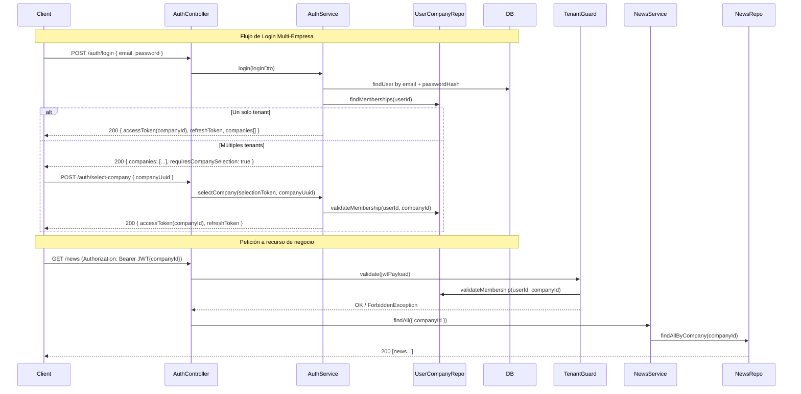

# RFC: Arquitectura Multi-Tenant por Empresa (RFC-004)

**Fecha:** 2026-06-15
**Autor:** Arquitecto Tech Lead (Vyma)
**Estado:** Draft

---

## 1. Propuesta Arquitectónica

### Justificación

El sistema actual es mono-tenant: todos los datos pertenecen a un único contexto de empresa. Para soportar múltiples empresas (tenants) se adopta la estrategia de **BD única con aislamiento por fila (`companyId`)**, ya que:

- El máximo de tenants estimado es **5 empresas**, lo que no justifica la complejidad operativa de múltiples bases de datos.
- Se elimina la necesidad de manejar múltiples conexiones TypeORM dinámicas en tiempo de ejecución.
- Las migraciones se ejecutan una sola vez para todos los tenants.
- El costo de infraestructura es mínimo (una sola instancia de PostgreSQL).

**Decisiones de diseño clave:**

1. Se crea el módulo `companies` con su entidad `Company` (empresa).
2. La relación entre `User` y `Company` es **Many-to-Many**, mediada por una entidad intermedia `UserCompany` que también lleva el `Role` que tiene ese usuario dentro de esa empresa específica.
3. Se agrega el flag `isSuperAdmin: boolean` a la entidad `User`. Permite crear un guard global en el futuro para un backoffice de administración de todas las empresas.
4. **Gestión de Roles Globales**: Los `Role` son **globales** (sin `companyId`). Como parte de este RFC, se refactorizan los roles existentes:
   - Se elimina el rol específico `ccps` (ya que pasa a ser una empresa en el sistema).
   - Se incorpora el rol `manager` (gerente o supervisor opcional).
   - **Alcance del Acceso:** El acceso a múltiples empresas (ej. 3 empresas) no requiere un rol especial "admin-global"; se logra asignando 3 membresías separadas en `user_companies`, cada una con el rol `admin`. Para una empresa individual, se asigna 1 sola membresía.
5. Todas las entidades de negocio (`News`, `Schedule`, `ScheduleBreak`, `Service`, `Profession`, etc.) reciben una relación `ManyToOne` hacia `Company`.
6. El `JWT` pasa a incluir `companyId` del contexto activo. Al hacer login, si el usuario pertenece a múltiples empresas, el backend retorna la lista de membresías y el frontend permite elegir. El token se emite con la empresa seleccionada.
7. Se crea un Guard `TenantGuard` que valida que el `companyId` del JWT corresponda a una membresía activa del usuario, previniendo que un usuario acceda a datos de otra empresa manipulando el token manualmente.

### Diagrama de Flujo



---

## 2. Modelo de Datos (TypeORM Schema)

### 2.1 Nueva Entidad: `Company`

```typescript
// src/companies/entities/company.entity.ts
import {
  Column,
  CreateDateColumn,
  Entity,
  Generated,
  Index,
  OneToMany,
  PrimaryGeneratedColumn,
  UpdateDateColumn,
} from 'typeorm';
import { UserCompany } from './user-company.entity';

@Entity('companies')
export class Company {
  @PrimaryGeneratedColumn('increment', { type: 'bigint' })
  id: number;

  @Column()
  @Generated('uuid')
  @Index({ unique: true })
  uuid: string;

  @Column('varchar', { length: 255, nullable: false })
  name: string;

  @Column('varchar', { length: 50, nullable: true, comment: 'RUC / CUIT / NIF según país' })
  taxId: string | null;

  @Column('varchar', { length: 100, nullable: true })
  email: string | null;

  @Column('varchar', { length: 20, nullable: true })
  phone: string | null;

  @Column('boolean', { default: true })
  isActive: boolean;

  @OneToMany(() => UserCompany, (uc) => uc.company)
  memberships: UserCompany[];

  @CreateDateColumn({ type: 'timestamp' })
  createdAt: Date;

  @UpdateDateColumn({ type: 'timestamp' })
  updatedAt: Date;
}
```

**Índices propuestos:**
- `uuid`: Lookup rápido por identificador público.
- `isActive`: Para filtrar empresas activas en listados.

---

### 2.2 Nueva Entidad: `UserCompany` (Membresía — Pivot)

Esta es la pieza central del diseño M:N con rol por empresa.

```typescript
// src/companies/entities/user-company.entity.ts
import {
  Column,
  CreateDateColumn,
  Entity,
  Index,
  JoinColumn,
  ManyToOne,
  PrimaryGeneratedColumn,
} from 'typeorm';
import { User } from '../../users/entities/user.entity';
import { Company } from './company.entity';
import { Role } from '../../roles/entities/role.entity';

@Entity('user_companies')
@Index(['userId', 'companyId'], { unique: true })
export class UserCompany {
  @PrimaryGeneratedColumn('increment', { type: 'bigint' })
  id: number;

  @Column({ name: 'user_id' })
  @Index()
  userId: number;

  @Column({ name: 'company_id' })
  @Index()
  companyId: number;

  @Column({ name: 'role_id' })
  roleId: number;

  @Column('boolean', { default: true, comment: 'Si la membresía está activa' })
  isActive: boolean;

  @ManyToOne(() => User, (user) => user.memberships, { onDelete: 'CASCADE' })
  @JoinColumn({ name: 'user_id' })
  user: User;

  @ManyToOne(() => Company, (company) => company.memberships, { onDelete: 'CASCADE' })
  @JoinColumn({ name: 'company_id' })
  company: Company;

  @ManyToOne(() => Role, { eager: true })
  @JoinColumn({ name: 'role_id' })
  role: Role;

  @CreateDateColumn({ type: 'timestamp' })
  createdAt: Date;
}
```

**Índices propuestos:**
- Índice compuesto `(userId, companyId)` con `unique: true`: garantiza una sola membresía por par usuario-empresa.
- FK `user_id`, `company_id`: Para lookups rápidos en el `TenantGuard`.

---

### 2.3 Modificaciones a la Entidad `User`

Campos nuevos a agregar en `src/users/entities/user.entity.ts`:

```typescript
// Columna nueva: isSuperAdmin
@Column('boolean', {
  default: false,
  comment: 'Si true, tiene acceso irrestricto a todas las empresas (futuro backoffice)',
})
isSuperAdmin: boolean;

// Relación nueva: memberships
@OneToMany(() => UserCompany, (uc) => uc.user)
memberships: UserCompany[];
```

> **Nota sobre la relación `role` existente en `User`:** Se **mantiene temporalmente** para no romper el `JwtStrategy` y los `RolesGuard` actuales. La migración hacia leer el rol desde `UserCompany` se hará de forma incremental. En este RFC, el rol del JWT se leerá desde la membresía activa al momento del login.

---

### 2.4 Modificaciones a Entidades de Negocio

Patrón a replicar en todas las entidades de negocio:

```typescript
@Column({ name: 'company_id' })
@Index()
companyId: number;

@ManyToOne(() => Company, { nullable: false, onDelete: 'CASCADE' })
@JoinColumn({ name: 'company_id' })
company: Company;
```

**Entidades afectadas:**

| Módulo | Entidad | Archivo |
|--------|---------|---------|
| `news` | `News` | `src/news/entities/news.entity.ts` |
| `schedules` | `Schedule` | `src/schedules/entities/schedule.entity.ts` |
| `schedule-breaks` | `ScheduleBreak` | `src/schedule-breaks/entities/schedule-break.entity.ts` |
| `services` | `Service` | `src/services/entities/service.entity.ts` |
| `professions` | `Profession` | `src/professions/entities/profession.entity.ts` |

> Los módulos `auth`, `users`, `roles` y `permissions` **no** se vinculan a `Company` directamente.

---

### 2.5 Interfaz `JwtPayload` Actualizada

```typescript
// src/auth/interfaces/jwt-payload.interface.ts
export interface JwtPayload {
  sub: number;           // user.id
  uuid: string;          // user.uuid
  email: string;
  role: string;          // rol del usuario en la empresa activa (desde UserCompany)
  companyId: number;     // empresa activa en esta sesión — NUEVO
  companyUuid: string;   // uuid público de la empresa activa — NUEVO
  isSuperAdmin: boolean; // acceso global sin tenant — NUEVO
  iat?: number;
}
```

---

## 3. Diseño de API y Contratos

### 3.1 Módulo `companies` — Endpoints

| Método | Ruta | Guard | Roles | Descripción |
|--------|------|-------|-------|-------------|
| `POST` | `/companies` | `JwtAuthGuard` | `superadmin` | Crea una nueva empresa |
| `GET` | `/companies` | `JwtAuthGuard` | `superadmin` | Lista todas las empresas |
| `GET` | `/companies/:uuid` | `JwtAuthGuard` | `superadmin`, `admin` | Detalle de una empresa |
| `PATCH` | `/companies/:uuid` | `JwtAuthGuard` | `superadmin` | Actualiza datos de la empresa |
| `POST` | `/companies/:uuid/members` | `JwtAuthGuard`, `TenantGuard` | `admin` | Agrega un usuario como miembro |
| `DELETE` | `/companies/:uuid/members/:userUuid` | `JwtAuthGuard`, `TenantGuard` | `admin` | Remueve un miembro |

#### DTO: `CreateCompanyDto`
```typescript
// src/companies/dto/create-company.dto.ts
export class CreateCompanyDto {
  @ApiProperty({ description: 'Nombre de la empresa', example: 'Biolimpieza SRL' })
  @IsString()
  @IsNotEmpty()
  @MaxLength(255)
  name: string;

  @ApiProperty({ description: 'RUC / CUIT / NIF', example: '80012345-1', required: false })
  @IsOptional()
  @IsString()
  @MaxLength(50)
  taxId?: string;

  @ApiProperty({ description: 'Email de contacto', required: false })
  @IsOptional()
  @IsEmail()
  email?: string;

  @ApiProperty({ description: 'Teléfono de contacto', required: false })
  @IsOptional()
  @IsString()
  @MaxLength(20)
  phone?: string;
}
```

#### DTO: `AddMemberDto`
```typescript
// src/companies/dto/add-member.dto.ts
export class AddMemberDto {
  @ApiProperty({ description: 'UUID del usuario a agregar' })
  @IsUUID()
  @IsNotEmpty()
  userUuid: string;

  @ApiProperty({ description: 'ID del rol a asignar en esta empresa', example: 2 })
  @IsInt()
  @IsPositive()
  roleId: number;
}
```

#### DTO: `CompanyResponseDto`
```typescript
// src/companies/dto/company-response.dto.ts
export class CompanyResponseDto {
  @ApiProperty() uuid: string;
  @ApiProperty() name: string;
  @ApiProperty() taxId: string | null;
  @ApiProperty() email: string | null;
  @ApiProperty() phone: string | null;
  @ApiProperty() isActive: boolean;
  @ApiProperty() createdAt: Date;
}
```

---

### 3.2 Módulo `auth` — Cambios en Login y Nuevo Endpoint

| Método | Ruta | Guard | Rate Limit | Descripción |
|--------|------|-------|------------|-------------|
| `POST` | `/auth/login` | Público | 5 req / 60s | Login. 1 empresa → JWT directo. N > 1 → lista de selección |
| `POST` | `/auth/select-company` | Público (selection token) | 10 req / 60s | Emite JWT final con `companyId` elegido |

#### Response `POST /auth/login` — Caso A (1 empresa)
```json
{
  "accessToken": "eyJhbGci...",
  "refreshToken": "d3f4a1b2c3...",
  "expiresIn": 900,
  "user": {
    "uuid": "a1b2c3d4-...",
    "name": "FEDERICO LÓPEZ",
    "email": "fede@example.com",
    "role": "admin",
    "company": { "uuid": "...", "name": "Biolimpieza SRL" }
  }
}
```

#### Response `POST /auth/login` — Caso B (múltiples empresas)
```json
{
  "requiresCompanySelection": true,
  "selectionToken": "eyJhbGci... (JWT de 5 min, sin companyId)",
  "companies": [
    { "uuid": "...", "name": "Empresa A", "role": "admin" },
    { "uuid": "...", "name": "Empresa B", "role": "employee" }
  ]
}
```

#### DTO: `SelectCompanyDto`
```typescript
// src/auth/dto/select-company.dto.ts
export class SelectCompanyDto {
  @ApiProperty({ description: 'UUID de la empresa a seleccionar' })
  @IsUUID()
  @IsNotEmpty()
  companyUuid: string;
}
```

---

### 3.3 Guard: `TenantGuard`

```typescript
// src/common/guards/tenant.guard.ts
// Lógica:
// 1. Extrae jwtPayload de req.user (ya validado por JwtAuthGuard)
// 2. Si isSuperAdmin === true → next() sin restricción
// 3. Si no → consulta UserCompanyRepository.isActiveMember(userId, companyId)
// 4. Si no es miembro → throw ForbiddenException('Access to this company is not allowed')
```

Se aplica en todos los controladores de recursos de negocio, siempre **después** de `JwtAuthGuard`.

---

## 4. Consideraciones de Seguridad y Performance

### 4.1 Prevención de Cross-Tenant Data Leaks

- **Primera línea:** `TenantGuard` valida membresía antes de llegar al servicio.
- **Segunda línea:** Todos los métodos de repositorios de negocio reciben `companyId` como parámetro obligatorio y lo incluyen en el `WHERE`:
  ```typescript
  findAll(companyId: number, filters?: FilterDto): Promise<Entity[]>
  ```
- El `companyId` **nunca** se lee del body del request; siempre del JWT validado por el guard.

### 4.2 Índices y Prevention de N+1

- Todos los campos `companyId` tienen `@Index()`.
- Índice compuesto único `(userId, companyId)` en `user_companies` → O(log n) en el `TenantGuard`.
- El login carga membresías con un único JOIN, no en N queries:
  ```typescript
  findOne({ where: { email }, relations: ['memberships', 'memberships.company', 'memberships.role'] })
  ```

### 4.3 Aislamiento del SuperAdmin

- `isSuperAdmin` en el JWT y en la entidad `User` son suficientes para un futuro Guard de backoffice.
- El `TenantGuard` y el futuro `SuperAdminGuard` son guards completamente separados y no se mezclan.

### 4.4 Estrategia de Migración de Datos Existentes

Los datos actuales en tablas de negocio no tienen `company_id`. La migración debe:

1. Agregar la columna `company_id` como `NULLABLE` inicialmente.
2. Ejecutar un backfill asignando `company_id = 1` a todos los registros existentes.
3. Agregar la constraint `NOT NULL` y el índice.

```sql
-- Ejemplo de backfill en la migración TypeORM (método up())
await queryRunner.query(`ALTER TABLE "news" ADD "company_id" bigint NULL`);
await queryRunner.query(`UPDATE "news" SET "company_id" = 1`);
await queryRunner.query(`ALTER TABLE "news" ALTER COLUMN "company_id" SET NOT NULL`);
await queryRunner.query(`CREATE INDEX "IDX_news_company_id" ON "news" ("company_id")`);
```

---

## 5. Plan de Implementación Secuencial

### Fase 0: Refactor de Roles Globales y Seed Data
- [ ] 0.1 Eliminar `ccps` e incorporar `manager` en el enum `ValidRoles` (`src/auth/interfaces/valid-roles.ts`).
- [ ] 0.2 Actualizar configuración en `src/seed/data/roles.seed-data.ts` para remover `ccps` e incluir `manager`.
- [ ] 0.3 Crear el archivo `src/seed/data/companies.seed-data.ts` con la data inicial (CCPS, Biolimpieza y NatyNails).


### Fase 1: Módulo `companies` — Entidades y Repositorios
- [ ] 1.1 Crear `src/companies/entities/company.entity.ts`
- [ ] 1.2 Crear `src/companies/entities/user-company.entity.ts`
- [ ] 1.3 Crear `src/companies/companies.module.ts` y registrar entidades
- [ ] 1.4 Crear `src/companies/repositories/companies.repository.ts`
- [ ] 1.5 Crear `src/companies/repositories/user-company.repository.ts`

### Fase 2: Migración de Base de Datos
- [ ] 2.1 Agregar `companyId` + relación a entidades de negocio (`News`, `Schedule`, `ScheduleBreak`, `Service`, `Profession`)
- [ ] 2.2 Agregar `isSuperAdmin` y `OneToMany memberships` a la entidad `User`
- [ ] 2.3 Generar la migración automática: `npm run typeorm:generate`
- [ ] 2.4 Editar la migración generada para incluir el backfill de datos existentes (paso crítico)
- [ ] 2.5 Ejecutar la migración: `npm run typeorm:run`

### Fase 3: Servicio y Controlador de `companies`
- [ ] 3.1 Crear `src/companies/companies.service.ts`
- [ ] 3.2 Crear `src/companies/companies.controller.ts` con Swagger completo
- [ ] 3.3 Crear DTOs: `CreateCompanyDto`, `UpdateCompanyDto`, `AddMemberDto`, `CompanyResponseDto`
- [ ] 3.4 Crear `src/companies/dto/index.ts`
- [ ] 3.5 Crear `src/companies/exceptions/company-not-found.exception.ts`
- [ ] 3.6 Crear `src/companies/exceptions/member-already-exists.exception.ts`
- [ ] 3.7 **[Test]** Pruebas unitarias de `CompaniesService` y `CompaniesController`

### Fase 4: Refactor del Módulo `auth` para Multi-Tenant
- [ ] 4.1 Actualizar `src/auth/interfaces/jwt-payload.interface.ts`
- [ ] 4.2 Actualizar `AuthService.login()` para consultar membresías y bifurcar la respuesta
- [ ] 4.3 Crear `src/auth/dto/select-company.dto.ts`
- [ ] 4.4 Implementar `AuthService.selectCompany(selectionToken, companyUuid)`
- [ ] 4.5 Agregar `POST /auth/select-company` en `AuthController`
- [ ] 4.6 Actualizar `JwtStrategy.validate()` para incluir `companyId` e `isSuperAdmin` en `req.user`
- [ ] 4.7 **[Test]** Pruebas unitarias del nuevo flujo de login y selección de empresa

### Fase 5: `TenantGuard` y Actualización de Servicios de Negocio
- [ ] 5.1 Crear `src/common/guards/tenant.guard.ts`
- [ ] 5.2 Aplicar `TenantGuard` en controladores de negocio (`NewsController`, `SchedulesController`, etc.)
- [ ] 5.3 Actualizar servicios de negocio para recibir y usar `companyId` del `req.user`
- [ ] 5.4 Actualizar repositorios de negocio para filtrar obligatoriamente por `companyId`
- [ ] 5.5 **[Test]** Pruebas unitarias de `TenantGuard` (usuario normal, superadmin, membresía inválida)
- [ ] 5.6 **[Test]** Pruebas unitarias de servicios/repositorios con filtrado por `companyId`

### Fase 6: E2E y Verificación Manual
- [ ] 6.1 Suite E2E: usuario con 1 empresa → login directo con JWT completo
- [ ] 6.2 Suite E2E: usuario con N empresas → login con selección → emite JWT
- [ ] 6.3 Verificar: usuario Tenant A recibe `403 Forbidden` al acceder a ID del Tenant B
- [ ] 6.4 Verificar: `isSuperAdmin` accede a recursos de cualquier empresa
- [ ] 6.5 Actualizar `.env.example` si se agregan variables
- [ ] 6.6 Verificar documentación Swagger de todos los endpoints modificados

---

## 6. Archivos a Crear / Modificar

### Archivos Nuevos [NEW]

| Archivo | Descripción |
|---------|-------------|
| `src/seed/data/companies.seed-data.ts` | Data inicial de empresas (CCPS, Biolimpieza, NatyNails) |
| `src/companies/companies.module.ts` | Módulo NestJS de empresas |
| `src/companies/companies.service.ts` | Lógica de negocio de empresas |
| `src/companies/companies.controller.ts` | Endpoints REST de empresas |
| `src/companies/entities/company.entity.ts` | Entidad TypeORM `Company` |
| `src/companies/entities/user-company.entity.ts` | Entidad pivot `UserCompany` |
| `src/companies/repositories/companies.repository.ts` | Repositorio de `Company` |
| `src/companies/repositories/user-company.repository.ts` | Repositorio de `UserCompany` |
| `src/companies/dto/create-company.dto.ts` | DTO de creación |
| `src/companies/dto/update-company.dto.ts` | DTO de actualización (PartialType) |
| `src/companies/dto/add-member.dto.ts` | DTO para agregar miembro |
| `src/companies/dto/company-response.dto.ts` | DTO de respuesta |
| `src/companies/dto/index.ts` | Re-exportaciones de DTOs |
| `src/companies/exceptions/company-not-found.exception.ts` | NotFoundException 404 |
| `src/companies/exceptions/member-already-exists.exception.ts` | ConflictException 409 |
| `src/auth/dto/select-company.dto.ts` | DTO de selección de empresa |
| `src/common/guards/tenant.guard.ts` | Guard de aislamiento por tenant |

### Archivos Modificados [MODIFY]

| Archivo | Cambio |
|---------|--------|
| `src/auth/interfaces/valid-roles.ts` | Eliminar `ccps`, agregar `manager` |
| `src/seed/data/roles.seed-data.ts` | Actualizar config de roles iniciales |
| `src/users/entities/user.entity.ts` | Agregar `isSuperAdmin` y `memberships` |
| `src/auth/interfaces/jwt-payload.interface.ts` | Agregar `companyId`, `companyUuid`, `isSuperAdmin` |
| `src/auth/auth.service.ts` | Nuevo flujo login + `selectCompany()` |
| `src/auth/auth.controller.ts` | Agregar endpoint `POST /auth/select-company` |
| `src/auth/strategies/jwt.strategy.ts` | Incluir `companyId` e `isSuperAdmin` en `req.user` |
| `src/news/entities/news.entity.ts` | Agregar `companyId` + relación `Company` |
| `src/schedules/entities/schedule.entity.ts` | Agregar `companyId` + relación `Company` |
| `src/schedule-breaks/entities/schedule-break.entity.ts` | Agregar `companyId` + relación `Company` |
| `src/services/entities/service.entity.ts` | Agregar `companyId` + relación `Company` |
| `src/professions/entities/profession.entity.ts` | Agregar `companyId` + relación `Company` |
| `src/news/services/news.service.ts` | Filtrar por `companyId` |
| `src/schedules/services/schedules.service.ts` | Filtrar por `companyId` |
| `src/app.module.ts` | Importar `CompaniesModule` |

---

## 7. Definition of Done (DoD)

### 1. Funcionalidad
- Un usuario puede iniciar sesión y, si tiene múltiples membresías, seleccionar su empresa activa.
- El JWT siempre contiene un `companyId` válido (excepto el selection token temporal de 5 min).
- Los endpoints de negocio validan la membresía vía `TenantGuard` antes de procesar el request.
- Un admin puede agregar/remover usuarios de su empresa con un rol específico.

### 2. Aislamiento de Datos
- Un usuario del Tenant A recibe `403 Forbidden` al intentar acceder a recursos del Tenant B.
- El `companyId` nunca se lee del body del request; siempre del JWT validado.

### 3. Pruebas y Cobertura
- Cobertura mínima **80%** en módulos nuevos y modificados.
- Suite E2E: login single-tenant, login multi-tenant, acceso cross-tenant (debe ser 403).

### 4. Estilo y Estructura
- Todos los archivos siguen convenciones de `convencion-arquitectura.md` (kebab-case, sufijos).
- Cero uso de `any` en código nuevo.
- Sin dependencias circulares entre `CompaniesModule` y otros módulos.
