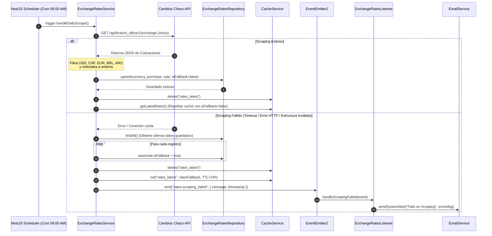

# RFC: Sistema de Cotizaciones y Widget de Monedas (RFC-005)

**Estado:** Draft
**Módulo:** `ExchangeRates` (Nuevo)
**Autor:** Principal Software Architect & Tech Lead

---

## 1. Architectural Proposal

### Justification
Se propone la creación de un nuevo módulo llamado `ExchangeRatesModule` (`src/exchange-rates/`) para encapsular toda la lógica de obtención, persistencia, caché y exposición de las cotizaciones referenciales de divisas extranjeras (USD, CHF, EUR, BRL, ARS) en Guaraníes (PYG). 

La arquitectura se fundamenta en los siguientes pilares de diseño y modularidad del proyecto:
1. **Flujo de Dependencias Limpio:** Se implementa el patrón `Controller -> Service -> Repository` respetando las restricciones del proyecto: los controladores no contienen lógica de negocio y los servicios no inyectan el repositorio de TypeORM directamente, sino que consumen la abstracción `IExchangeRatesRepository`.
2. **Estrategia de Caché en Memoria (0 DB Queries):** Para optimizar el rendimiento y reducir la carga sobre la base de datos en la VPS Linode (2GB RAM), las lecturas de los clientes (`GET /api/v1/rates/latest`) se resuelven en memoria utilizando el servicio `CacheService` global.
3. **Desacoplamiento de Efectos Secundarios mediante Eventos (EDA):** El cron job de scraping corre de forma asíncrona a las 06:00 AM. Si el scraping falla, se emite un evento `rates.scraping_failed` a través de `@nestjs/event-emitter`. El módulo de cotizaciones no conoce los detalles de envío de notificaciones (por email/Resend), los cuales son manejados de forma desacoplada por un listener de eventos que invoca al `EmailService`.
4. **Persistencia Simplificada sin Historial Innecesario:** Al ser cotizaciones puramente referenciales, solo mantendremos las cotizaciones más recientes en la tabla `exchange_rates` (máximo 5 filas, una por divisa). Las actualizaciones diarias realizarán un `upsert` (actualización de valores) sobre estas filas existentes.

### Flow Diagram

El siguiente diagrama detalla el flujo de ejecución del scraper diario (Cron) y el manejo desacoplado en caso de fallos:



---

## 2. Data Model (TypeORM Schema)

### Entities & Relations

Para la persistencia, se creará la entidad `ExchangeRate` en `src/exchange-rates/entities/exchange-rate.entity.ts`. Se mantendrá una estructura simple de un registro por divisa (USD, CHF, EUR, BRL, ARS):

```typescript
import {
  Entity,
  PrimaryGeneratedColumn,
  Column,
  CreateDateColumn,
  UpdateDateColumn,
  Index,
} from 'typeorm';

@Entity('exchange_rates')
export class ExchangeRate {
  @PrimaryGeneratedColumn('increment', { type: 'bigint' })
  id: number;

  @Index({ unique: true })
  @Column({ type: 'varchar', length: 10 })
  currency: string; // 'USD', 'CHF', 'EUR', 'BRL', 'ARS'

  @Column({ type: 'integer' })
  purchasePrice: number; // Compra (entero redondeado)

  @Column({ type: 'integer' })
  salePrice: number; // Venta (entero redondeado)

  @Column({ type: 'boolean', default: false })
  isFallback: boolean; // Indica si se está sirviendo como contingencia

  @CreateDateColumn({ type: 'timestamp' })
  createdAt: Date;

  @UpdateDateColumn({ type: 'timestamp' })
  updatedAt: Date;
}
```

### Performance
* **Indexación:** Se añade un `@Index({ unique: true })` sobre el campo `currency` para asegurar búsquedas ultra rápidas de cotizaciones por código de divisa y prevenir registros duplicados.
* **Cascading y Relaciones:** Al ser un catálogo plano e independiente, no posee relaciones con otras tablas, lo que previene problemas de N+1 consultas.
* **Consultas de Lectura:** Se ejecuta un `findAll()` plano que recupera un máximo de 5 registros de forma secuencial, por lo que la latencia a nivel de base de datos es inferior a 2ms.

---

## 3. API Design & Contracts

### Endpoints Table

| Método | Ruta | Guard | Roles / Permisos | Descripción |
|---|---|---|---|---|
| `GET` | `/api/v1/rates/latest` | Ninguno (Público) | Todos | Obtiene las últimas cotizaciones guardadas en caché o base de datos. |
| `POST` | `/api/v1/rates/scrape` | `AuthGuard('jwt')`, `PermissionsGuard` | `write:exchange-rates` | Dispara manualmente el scraping de cotizaciones y refresca el caché. |

### DTOs

#### 1. DTO de Elemento de Divisa (`src/exchange-rates/dto/rate.dto.ts`)
```typescript
import { ApiProperty } from '@nestjs/swagger';
import { IsString, IsInt } from 'class-validator';

export class RateDto {
  @ApiProperty({ description: 'Código ISO de la divisa', example: 'USD' })
  @IsString()
  currency: string;

  @ApiProperty({ description: 'Precio de compra referencial (entero)', example: 6050 })
  @IsInt()
  purchasePrice: number;

  @ApiProperty({ description: 'Precio de venta referencial (entero)', example: 6120 })
  @IsInt()
  salePrice: number;
}
```

#### 2. DTO de Respuesta de Cotizaciones (`src/exchange-rates/dto/exchange-rates-response.dto.ts`)
```typescript
import { ApiProperty } from '@nestjs/swagger';
import { IsDate, IsBoolean, IsArray, ValidateNested } from 'class-validator';
import { Type } from 'class-transformer';
import { RateDto } from './rate.dto';

export class ExchangeRatesResponseDto {
  @ApiProperty({ description: 'Fecha y hora de la última actualización', example: '2026-06-17T17:00:00.000Z' })
  @IsDate()
  updatedAt: Date;

  @ApiProperty({ description: 'Indica si los datos provienen de un estado de fallback (falló el scraper)', example: false })
  @IsBoolean()
  fallback: boolean;

  @ApiProperty({ description: 'Lista de cotizaciones de divisas', type: [RateDto] })
  @IsArray()
  @ValidateNested({ each: true })
  @Type(() => RateDto)
  rates: RateDto[];
}
```

#### 3. DTO de Respuesta de Scraping Manual (`src/exchange-rates/dto/manual-scrape-response.dto.ts`)
```typescript
import { ApiProperty } from '@nestjs/swagger';
import { IsString } from 'class-validator';

export class ManualScrapeResponseDto {
  @ApiProperty({ description: 'Mensaje de confirmación del scraping manual', example: 'Scraping completado exitosamente y cotizaciones actualizadas.' })
  @IsString()
  message: string;
}
```

---

## 4. Security & Performance Considerations

* **Cross-Tenant Data Leaks:** Las cotizaciones son información global y de acceso público para todo el portal. No contienen relación alguna con los tenants (empresas) del sistema ni filtrado basado en la estructura de multi-tenancy, descartando cualquier riesgo de fuga de datos sensibles entre organizaciones.
* **Prevención de N+1 Query Bottlenecks:** La obtención de cotizaciones se realiza mediante un `findAll()` plano que lee una sola tabla sin joins adicionales.
* **Mitigación de Latencia de API Externa:** El scraping de la API de Cambios Chaco es pesado y puede fallar o demorar por latencia de red. El widget de Astro consumirá el endpoint `GET /api/v1/rates/latest`, el cual responde directamente del caché en memoria del backend (`CacheService`), garantizando tiempos de respuesta mínimos (< 5ms) y evitando solicitudes salientes o consultas a la BD durante la carga de la página del usuario.
* **Seguridad y Rate Limiting:**
  - El endpoint público `/api/v1/rates/latest` está sujeto al `ThrottlerGuard` global del backend (30 peticiones por minuto por IP), mitigando ataques DDoS.
  - El endpoint de actualización manual `/api/v1/rates/scrape` requiere autenticación JWT y un permiso granular `write:exchange-rates` para evitar ejecuciones maliciosas o sobrecarga de solicitudes a la API de Cambios Chaco.
* **Restricción de Recursos en VPS (2GB RAM):** El scraper se programa para ejecutarse en horarios de baja demanda (06:00 AM) y no mantiene conexiones de red persistentes. Adicionalmente, el Garbage Collector de PM2 mantendrá la VPS libre de fugas de memoria al limpiar la caché inactiva.

---

## 5. Sequential Implementation Plan

Este plan servirá como checklist exclusivo y secuencial para la construcción completa de la funcionalidad.

### Phase 1: Database & Persistence

- [x] **Tarea 1.1: Crear la Entidad `ExchangeRate`**
  - **Archivos a crear/modificar:** [ExchangeRate entity](file:///c:/Users/fedel/NestJs/vyma_backend/src/exchange-rates/entities/exchange-rate.entity.ts)
  - **Criterios de Aceptación:** Estructura de columnas idéntica a la Sección 2, sin usar `any`.

- [x] **Tarea 1.2: Generar y Ejecutar Migración**
  - **Descripción:** Generar la migración de base de datos y ejecutarla localmente para crear la tabla `exchange_rates`.
  - **Archivos a crear/modificar:** `src/database/migrations/*`
  - **Criterios de Aceptación:** Ejecución exitosa de `npm run typeorm:generate -- -n CreateExchangeRatesTable` y posterior aplicación con `npm run typeorm:run` sin errores de schema.

### Phase 2: Domain & Business Logic (Self-Tested)

- [x] **Tarea 2.1: Crear Interfaces de Repositorio**
  - **Descripción:** Definir el contrato de abstracción del repositorio `IExchangeRatesRepository` y su token de inyección.
  - **Archivos a crear/modificar:** `src/exchange-rates/interfaces/exchange-rates-repository.interface.ts`
  - **Criterios de Aceptación:** Contiene los contratos de firma para `findAll`, `findByCurrency`, `save` y `upsert`.

- [x] **Tarea 2.2: Implementar Repositorio Personalizado**
  - **Descripción:** Escribir la implementación concreta del repositorio que utiliza el `Repository<ExchangeRate>` inyectado por TypeORM.
  - **Archivos a crear/modificar:** `src/exchange-rates/repositories/exchange-rates.repository.ts`
  - **Criterios de Aceptación:** Cumple con la interfaz y realiza correctamente el `upsert` controlando la creación o modificación de los datos.

- [x] **Tarea 2.3: Actualizar Configuración y Variables de Entorno**
  - **Descripción:** Agregar `ADMIN_EMAIL` en `.env.example` y validar su presencia en `env.validation.ts` como string de correo electrónico.
  - **Archivos a crear/modificar:** [env.validation.ts](file:///c:/Users/fedel/NestJs/vyma_backend/src/config/env.validation.ts), [.env.example](file:///c:/Users/fedel/NestJs/vyma_backend/.env.example)
  - **Criterios de Aceptación:** Validación estricta con `IsEmail()` y arranque exitoso del servidor.

- [x] **Tarea 2.4: Agregar Método de Alerta en `EmailService`**
  - **Descripción:** Implementar el método `sendSystemAlert` en `EmailService` para el envío de notificaciones del sistema mediante Resend utilizando HTML limpio.
  - **Archivos a crear/modificar:** [email.service.ts](file:///c:/Users/fedel/NestJs/vyma_backend/src/email/email.service.ts)
  - **Criterios de Aceptación:** Compilación y funcionamiento correcto con Resend.

- [x] **Tarea 2.5: Implementar el Servicio `ExchangeRatesService`**
  - **Descripción:** Implementar la lógica del servicio principal: `getLatestRates()` (con estrategia de Caché) y `scrapeRates()` (con integración HTTP Axios a Cambios Chaco, redondeo a enteros y manejo de fallback).
  - **Archivos a crear/modificar:** `src/exchange-rates/exchange-rates.service.ts`
  - **Criterios de Aceptación:** Cumple con las especificaciones. Lanza evento `rates.scraping_failed` en caso de error y maneja el fallback correctamente.

- [x] **Tarea 2.6: Escribir Pruebas Unitarias del Servicio**
  - **Descripción:** Escribir las pruebas unitarias para `ExchangeRatesService` mockeando el repositorio, `CacheService` y `EventEmitter2`.
  - **Archivos a crear/modificar:** `src/exchange-rates/exchange-rates.service.spec.ts`
  - **Criterios de Aceptación:** Cobertura de tests unitarios del servicio >= 80%. Cobertura del happy path y de los casos de fallo / contingencia.

### Phase 3: API & Controllers (Self-Tested)

- [x] **Tarea 3.1: Crear DTOs con Validación**
  - **Descripción:** Crear los DTOs de entrada y salida para estructurar las respuestas y documentarlas con Swagger.
  - **Archivos a crear/modificar:**
    - `src/exchange-rates/dto/rate.dto.ts`
    - `src/exchange-rates/dto/exchange-rates-response.dto.ts`
    - `src/exchange-rates/dto/manual-scrape-response.dto.ts`
    - `src/exchange-rates/dto/index.ts` (exportador)
  - **Criterios de Aceptación:** Validación de tipos estricta sin any, uso de `@ApiProperty`.

- [x] **Tarea 3.2: Implementar Decoradores de Swagger**
  - **Descripción:** Agrupar decoradores Swagger del controlador para mantener el archivo limpio.
  - **Archivos a crear/modificar:** `src/exchange-rates/decorators/exchange-rates-swagger.decorators.ts`
  - **Criterios de Aceptación:** Decoradores separados para `ApiGetLatestRates` y `ApiTriggerScrape`.

- [x] **Tarea 3.3: Implementar Controlador `ExchangeRatesController`**
  - **Descripción:** Configurar los endpoints `GET /api/v1/rates/latest` (público) y `POST /api/v1/rates/scrape` (protegido por JWT y permiso `write:exchange-rates`).
  - **Archivos a crear/modificar:** `src/exchange-rates/exchange-rates.controller.ts`
  - **Criterios de Aceptación:** Ruteo correcto, respuestas tipadas semánticamente, control del flujo de guards.

- [x] **Tarea 3.4: Escribir Pruebas Unitarias del Controlador**
  - **Descripción:** Validar ruteos y respuestas simulando llamadas mediante unit tests mockeando el servicio.
  - **Archivos a crear/modificar:** `src/exchange-rates/exchange-rates.controller.spec.ts`
  - **Criterios de Aceptación:** Tests exitosos y cobertura de código >= 80%.

### Phase 4: Events, Cron & Integrations (Self-Tested)

- [x] **Tarea 4.1: Implementar Listener de Evento de Fallo**
  - **Descripción:** Implementar `ExchangeRatesListener` para escuchar el evento `rates.scraping_failed` y disparar el correo de alerta a través del método `sendSystemAlert` de `EmailService`.
  - **Archivos a crear/modificar:** `src/exchange-rates/listeners/exchange-rates.listener.ts`
  - **Criterios de Aceptación:** Captura de excepciones robusta dentro del listener para evitar fallos del runtime general.

- [x] **Tarea 4.2: Implementar Tarea Programada (Cron Job)**
  - **Descripción:** Crear `ExchangeRatesCron` para ejecutar diariamente a las 06:00 AM (Lunes a Viernes) la sincronización de cotizaciones.
  - **Archivos a crear/modificar:** `src/exchange-rates/cron/exchange-rates.cron.ts`
  - **Criterios de Aceptación:** Expresión cron `0 0 6 * * 1-5` y logueo adecuado.

- [x] **Tarea 4.3: Definir e Importar el Módulo `ExchangeRatesModule`**
  - **Descripción:** Definir el módulo funcional de NestJS de cotizaciones e importarlo en el módulo raíz de la aplicación.
  - **Archivos a crear/modificar:**
    - `src/exchange-rates/exchange-rates.module.ts`
    - [app.module.ts](file:///c:/Users/fedel/NestJs/vyma_backend/src/app.module.ts)
  - **Criterios de Aceptación:** Importaciones limpias, inyección correcta de dependencias y arranque del servidor sin errores.

- [x] **Tarea 4.4: Escribir Pruebas Unitarias de Eventos y Cron**
  - **Descripción:** Escribir unit tests para asegurar el comportamiento correcto del Cron y del Listener.
  - **Archivos a crear/modificar:**
    - `src/exchange-rates/listeners/exchange-rates.listener.spec.ts`
  - **Criterios de Aceptación:** Ejecución exitosa de pruebas.

### Phase 5: Verification E2E Final

- [x] **Tarea 5.1: Pruebas E2E manuales de Endpoints**
  - **Descripción:** Levantar el servidor localmente y consumir los endpoints utilizando Postman/cURL para verificar respuestas en vivo del backend.
  - **Archivos a crear/modificar:** Ninguno.
  - **Criterios de Aceptación:**
    - `GET /api/v1/rates/latest` retorna JSON con USD, CHF, EUR, BRL, ARS formateados como enteros, `fallback: false` y fecha actual.
    - Llamar a `POST /api/v1/rates/scrape` con token JWT válido con permiso ejecuta el scrape y responde 200 OK.
    - Llamar a `POST /api/v1/rates/scrape` sin token o sin permisos retorna 401 / 403 respectivamente.
    - Forzar un error (ej. desconectando internet o simulando URL inválida) y verificar que `GET /api/v1/rates/latest` retorne `fallback: true` y que el correo de alerta llegue a la casilla configurada.
