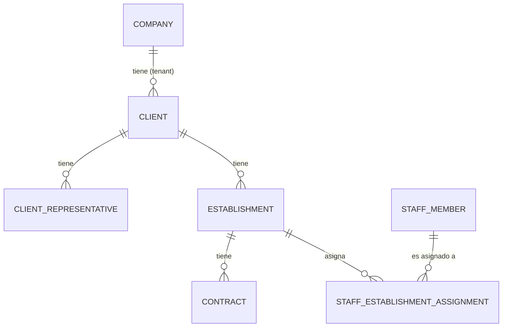

# RFC 013: Módulo de Clientes, Establecimientos y Contratos B2B

- **Estado:** Propuesto (Draft)
- **Fecha:** 2026-08-03
- **Autor:** Principal Software Architect & Tech Lead
- **PRD de Referencia:** [PRD-clientes-empresas.md](file:///c:/Users/fedel/NestJs/vyma_backend/docs/PRDs/PRD-clientes-empresas.md)
- **RFC Relacionado:** [RFC-012-modulo-personal.md](file:///c:/Users/fedel/NestJs/vyma_backend/docs/RFCs/RFC-012-modulo-personal.md) — `StaffModule`
- **Módulo Destino:** `src/clients/` (`ClientsModule`)

---

## 1. Resumen Ejecutivo

El presente RFC define la arquitectura técnica para el **Módulo de Clientes (`ClientsModule`)** en el backend NestJS de VyMA.

Este módulo gestiona la **Cuenta Corporativa** (persona física o jurídica) que actúa como beneficiaria del servicio. Es una entidad completamente separada del `Company` (tenant que usa el sistema): un `Company` (tenant/empresa prestadora) puede tener múltiples `Client`s (empresas contratantes).

El módulo abarca cuatro subentidades principales: `Client` (ficha fiscal), `ClientRepresentative` (representantes y firmantes), `Establishment` (sedes operativas con geocerca) y `Contract` (contratos B2B). La asignación de `StaffMember` a `Establishment` se implementa mediante relación **N:M** desde la **Fase 1**, reemplazando el campo `assignedLocation varchar` del RFC-012.

El desarrollo se estructura en **tres fases incrementales**, priorizando el registro y consulta de la ficha completa del cliente en el MVP.

---

## 2. Hoja de Ruta de Evolución (Roadmap por Fases)

```mermaid
graph TD
    subgraph "Fase 1: MVP — Ficha del Cliente"
        F1A["CRUD Client (Ficha Fiscal PF/PJ)"]
        F1B["CRUD ClientRepresentative"]
        F1C["CRUD Establishment + Geocerca (opcional)"]
        F1D["CRUD Contract (Abono Fijo requerido)"]
        F1E["Relación N:M Staff ↔ Establishment (tabla pivot)"]
    end

    subgraph "Fase 2: Operativa y Control de Cobertura"
        F2A["Dashboard de Cobertura Real-Time (WebSocket)"]
        F2B["Alertas de Vencimiento (Contratos 60-90 días)"]
        F2C["Alertas Documentación Impositiva (Cédula/SET/Form101)"]
        F2D["Validación geocerca en marcación (StaffModule Fase 2)"]
        F2E["Centros de Costo por Establishment"]
        F2F["Bolsa de Horas — cómputo de saldo y consumo"]
    end

    subgraph "Fase 3: Integraciones y Facturación Electrónica"
        F3A["Pre-liquidación SIFEN (consolidación cargos fijos+variables)"]
        F3B["Firma Digital XML + CDC WebService SIFEN/DNIT"]
        F3C["Generación e-KuDE PDF con QR de validación"]
        F3D["Distribución omnicanal (email + WhatsApp)"]
        F3E["SDR — Service Delivery Report mensual"]
        F3F["Auditoría SUACE/VUE (Log RUC y Representantes)"]
    end

    Fase 1 --> Fase 2 --> Fase 3
```

### Detalle de Fases:
- 🟢 **Fase 1 (MVP actual)**: Ficha fiscal del cliente (PF/PJ), representantes, sedes operativas con geocerca opcional, contrato de abono fijo y relación N:M staff↔establecimiento. Acceso exclusivo para `ADMIN` y `MANAGER` del tenant.
- 🟡 **Fase 2**: Dashboard de cobertura en tiempo real, motor de alertas de vencimiento de contratos y documentación, centros de costo y lógica de bolsa de horas.
- 🔴 **Fase 3**: Integración completa con SIFEN/DNIT para factura electrónica, SDR mensual y auditoría SUACE/VUE.

---

## 3. Arquitectura del Tenant vs. Cliente

```
Company (Tenant)          ← Multi-tenant. Empresa que PRESTA el servicio (usa VyMA).
  └── Client              ← Empresa que RECIBE el servicio. N clientes por tenant.
        ├── ClientRepresentative   ← Firmantes / apoderados del cliente.
        ├── Establishment          ← Sedes operativas del cliente.
        │     └── Contract         ← Contrato B2B por establecimiento.
        └── [N:M via staff_establishment_assignments]
              └── StaffMember      ← Personal asignado a la sede (RFC-012).
```

---

## 4. Estructura de Archivos del Módulo (`src/clients/`)

```
src/clients/
├── clients.module.ts
├── clients.controller.ts                    # Endpoints /clients
├── clients.controller.spec.ts
├── clients.service.ts
├── clients.service.spec.ts
│
├── constants/
│   └── clients-enums.ts                     # Enums: ClientType, TaxCondition, ContractType, etc.
│
├── decorators/
│   └── clients-swagger.decorators.ts        # Swagger composed decorators (regla Architect)
│
├── dto/
│   ├── client/
│   │   ├── create-client.dto.ts
│   │   ├── update-client.dto.ts
│   │   ├── client-response.dto.ts
│   │   └── query-client.dto.ts
│   ├── representative/
│   │   ├── create-client-representative.dto.ts
│   │   ├── update-client-representative.dto.ts
│   │   └── client-representative-response.dto.ts
│   ├── establishment/
│   │   ├── create-establishment.dto.ts
│   │   ├── update-establishment.dto.ts
│   │   └── establishment-response.dto.ts
│   ├── contract/
│   │   ├── create-contract.dto.ts
│   │   ├── update-contract.dto.ts
│   │   └── contract-response.dto.ts
│   └── index.ts                             # Barrel export
│
├── entities/
│   ├── client.entity.ts
│   ├── client-representative.entity.ts
│   ├── establishment.entity.ts
│   ├── contract.entity.ts
│   └── staff-establishment-assignment.entity.ts   # Tabla pivot N:M
│
├── exceptions/
│   ├── client-not-found.exception.ts
│   ├── client-duplicate-ruc.exception.ts
│   ├── establishment-not-found.exception.ts
│   ├── contract-not-found.exception.ts
│   └── representative-not-found.exception.ts
│
├── interfaces/
│   └── i-clients-repository.interface.ts
│
└── repositories/
    └── clients.repository.ts
```

---

## 5. API Endpoints

> **Auth**: Todos los endpoints requieren `JwtAuthGuard + RolesGuard`. Roles permitidos: `ADMIN`, `MANAGER` (del tenant correspondiente). Ningún endpoint es público.

### 5.1 Clientes (`/api/v1/clients`)

| Método | Path | Roles | DTO Request | DTO Response | Descripción |
|:---|:---|:---|:---|:---|:---|
| `GET` | `/api/v1/clients` | ADMIN, MANAGER | `QueryClientDto` | `PaginatedClientResponseDto` | Lista paginada de clientes del tenant. Filtros: `type`, `ruc`, `fantasyName`, `status` |
| `GET` | `/api/v1/clients/:id` | ADMIN, MANAGER | — | `ClientResponseDto` | Detalle completo del cliente (incluye representantes y establecimientos) |
| `POST` | `/api/v1/clients` | ADMIN, MANAGER | `CreateClientDto` | `ClientResponseDto` | Crear nuevo cliente (PF o PJ) |
| `PATCH` | `/api/v1/clients/:id` | ADMIN, MANAGER | `UpdateClientDto` | `ClientResponseDto` | Actualizar ficha fiscal del cliente |
| `DELETE` | `/api/v1/clients/:id` | ADMIN | — | `void` | Eliminación lógica (`isActive: false`) |

### 5.2 Representantes (`/api/v1/clients/:clientId/representatives`)

| Método | Path | Roles | DTO Request | DTO Response | Descripción |
|:---|:---|:---|:---|:---|:---|
| `GET` | `/api/v1/clients/:clientId/representatives` | ADMIN, MANAGER | — | `ClientRepresentativeResponseDto[]` | Lista de representantes del cliente |
| `POST` | `/api/v1/clients/:clientId/representatives` | ADMIN, MANAGER | `CreateClientRepresentativeDto` | `ClientRepresentativeResponseDto` | Agregar representante/firmante |
| `PATCH` | `/api/v1/clients/:clientId/representatives/:id` | ADMIN, MANAGER | `UpdateClientRepresentativeDto` | `ClientRepresentativeResponseDto` | Actualizar representante |
| `DELETE` | `/api/v1/clients/:clientId/representatives/:id` | ADMIN, MANAGER | — | `void` | Eliminar representante |

### 5.3 Establecimientos (`/api/v1/clients/:clientId/establishments`)

| Método | Path | Roles | DTO Request | DTO Response | Descripción |
|:---|:---|:---|:---|:---|:---|
| `GET` | `/api/v1/clients/:clientId/establishments` | ADMIN, MANAGER | — | `EstablishmentResponseDto[]` | Lista de sedes del cliente |
| `GET` | `/api/v1/clients/:clientId/establishments/:id` | ADMIN, MANAGER | — | `EstablishmentResponseDto` | Detalle de una sede (con contratos y staff asignado) |
| `POST` | `/api/v1/clients/:clientId/establishments` | ADMIN, MANAGER | `CreateEstablishmentDto` | `EstablishmentResponseDto` | Crear sede operativa |
| `PATCH` | `/api/v1/clients/:clientId/establishments/:id` | ADMIN, MANAGER | `UpdateEstablishmentDto` | `EstablishmentResponseDto` | Actualizar sede o geocerca |
| `DELETE` | `/api/v1/clients/:clientId/establishments/:id` | ADMIN | — | `void` | Eliminación lógica de sede |

### 5.4 Contratos (`/api/v1/clients/:clientId/establishments/:establishmentId/contracts`)

| Método | Path | Roles | DTO Request | DTO Response | Descripción |
|:---|:---|:---|:---|:---|:---|
| `GET` | `.../contracts` | ADMIN, MANAGER | — | `ContractResponseDto[]` | Lista contratos del establecimiento |
| `GET` | `.../contracts/:id` | ADMIN, MANAGER | — | `ContractResponseDto` | Detalle del contrato |
| `POST` | `.../contracts` | ADMIN, MANAGER | `CreateContractDto` | `ContractResponseDto` | Crear contrato (tipo `ABONO_FIJO` requerido en MVP) |
| `PATCH` | `.../contracts/:id` | ADMIN, MANAGER | `UpdateContractDto` | `ContractResponseDto` | Actualizar contrato |
| `DELETE` | `.../contracts/:id` | ADMIN | — | `void` | Eliminación lógica |

### 5.5 Asignación N:M Staff ↔ Establecimiento

| Método | Path | Roles | DTO Request | DTO Response | Descripción |
|:---|:---|:---|:---|:---|:---|
| `GET` | `/api/v1/clients/:clientId/establishments/:id/staff` | ADMIN, MANAGER | — | `StaffAssignmentResponseDto[]` | Personal asignado a la sede |
| `POST` | `/api/v1/clients/:clientId/establishments/:id/staff` | ADMIN, MANAGER | `{ staffMemberId: number, startDate: string }` | `StaffAssignmentResponseDto` | Asignar staff member a la sede |
| `DELETE` | `/api/v1/clients/:clientId/establishments/:id/staff/:staffId` | ADMIN, MANAGER | — | `void` | Desasignar (endDate = now, isActive = false) |

---

## 6. Esquema de Base de Datos

### 6.1 Tabla: `clients`

```typescript
import {
  Entity, PrimaryGeneratedColumn, Column,
  CreateDateColumn, UpdateDateColumn, DeleteDateColumn,
  Index, ManyToOne, JoinColumn, OneToMany,
} from 'typeorm';
import { Company } from '../companies/entities/company.entity';

export enum ClientType {
  PERSONA_FISICA   = 'PERSONA_FISICA',
  PERSONA_JURIDICA = 'PERSONA_JURIDICA',
}

export enum TaxCondition {
  IVA_10 = 'IVA_10',
  IVA_5  = 'IVA_5',
  EXENTO = 'EXENTO',
}

export enum BusinessForm {
  // Persona Física
  EIRL         = 'EIRL',
  CONDOMINIO   = 'CONDOMINIO',
  SUCESION     = 'SUCESION',
  // Persona Jurídica
  SA           = 'SA',
  SRL          = 'SRL',
  SUCURSAL_EXT = 'SUCURSAL_EXT',
  SIMPLE       = 'SIMPLE',
}

@Entity('clients')
export class Client {
  @PrimaryGeneratedColumn('uuid')
  id: string;

  // Tenant dueño del registro
  @Index()
  @Column({ type: 'bigint' })
  companyId: number;

  @ManyToOne(() => Company, { onDelete: 'CASCADE' })
  @JoinColumn({ name: 'companyId' })
  company: Company;

  // Datos Fiscales
  @Column({ type: 'enum', enum: ClientType })
  clientType: ClientType;

  @Index()
  @Column({ type: 'varchar', length: 20 })
  ruc: string;                              // RUC Paraguay (con dígito verificador)
  // UNIQUE INDEX compuesto: (companyId, ruc) definido en migración

  @Column({ type: 'varchar', length: 200 })
  businessName: string;                     // Razón Social / Nombre del Propietario

  @Column({ type: 'varchar', length: 200, nullable: true })
  fantasyName: string | null;               // Nombre de Fantasía

  @Column({ type: 'enum', enum: TaxCondition, default: TaxCondition.IVA_10 })
  taxCondition: TaxCondition;

  @Column({ type: 'enum', enum: BusinessForm, nullable: true })
  businessForm: BusinessForm | null;

  // Solo Persona Física (nullable — obligatorio en DTO si clientType = PERSONA_FISICA)
  @Column({ type: 'varchar', length: 100, nullable: true })
  firstName: string | null;

  @Column({ type: 'varchar', length: 100, nullable: true })
  lastName: string | null;

  @Column({ type: 'date', nullable: true })
  birthDate: Date | null;

  // Contacto
  @Column({ type: 'varchar', length: 150, nullable: true })
  emailPrimary: string | null;

  @Column({ type: 'varchar', length: 150, nullable: true })
  emailSecondary: string | null;

  @Column({ type: 'varchar', length: 30, nullable: true })
  phone: string | null;

  // Domicilio Fiscal
  @Column({ type: 'varchar', length: 100, nullable: true })
  fiscalDepartment: string | null;

  @Column({ type: 'varchar', length: 100, nullable: true })
  fiscalDistrict: string | null;

  @Column({ type: 'varchar', length: 100, nullable: true })
  fiscalLocality: string | null;

  @Column({ type: 'varchar', length: 100, nullable: true })
  fiscalNeighborhood: string | null;

  @Column({ type: 'varchar', length: 255, nullable: true })
  fiscalAddress: string | null;

  // Relaciones
  @OneToMany(() => ClientRepresentative, (r) => r.client, { cascade: true })
  representatives: ClientRepresentative[];

  @OneToMany(() => Establishment, (e) => e.client, { cascade: true })
  establishments: Establishment[];

  @CreateDateColumn({ type: 'timestamptz' })
  createdAt: Date;

  @UpdateDateColumn({ type: 'timestamptz' })
  updatedAt: Date;

  @DeleteDateColumn({ type: 'timestamptz' })
  deletedAt: Date;
}
```

---

### 6.2 Tabla: `client_representatives`

```typescript
export enum RepresentativeRole {
  PROPIETARIO = 'PROPIETARIO',
  GERENTE     = 'GERENTE',
  SOCIO       = 'SOCIO',
  APODERADO   = 'APODERADO',
}

export enum DocumentType {
  CEDULA_PY = 'CEDULA_PY',
  PASAPORTE = 'PASAPORTE',
  RUC       = 'RUC',
}

@Entity('client_representatives')
export class ClientRepresentative {
  @PrimaryGeneratedColumn('uuid')
  id: string;

  @Index()
  @Column({ type: 'uuid' })
  clientId: string;

  @ManyToOne(() => Client, (c) => c.representatives, { onDelete: 'CASCADE' })
  @JoinColumn({ name: 'clientId' })
  client: Client;

  // Identificación (requerida por formulario VUE)
  @Column({ type: 'varchar', length: 100 })
  firstName: string;

  @Column({ type: 'varchar', length: 100 })
  lastName: string;

  @Column({ type: 'enum', enum: DocumentType, default: DocumentType.CEDULA_PY })
  documentType: DocumentType;

  @Column({ type: 'varchar', length: 30 })
  documentNumber: string;

  @Column({ type: 'varchar', length: 60, nullable: true })
  nationality: string | null;

  @Column({ type: 'varchar', length: 20, nullable: true })
  gender: string | null;

  @Column({ type: 'varchar', length: 30, nullable: true })
  maritalStatus: string | null;

  // Perfil Profesional
  @Column({ type: 'enum', enum: RepresentativeRole })
  role: RepresentativeRole;

  @Column({ type: 'varchar', length: 100, nullable: true })
  profession: string | null;

  @Column({ type: 'varchar', length: 50, nullable: true })
  professionalRegistrationNumber: string | null;

  // Vigencia del Cargo
  @Column({ type: 'date', nullable: true })
  roleStartDate: Date | null;

  @Column({ type: 'date', nullable: true })
  roleEndDate: Date | null;               // Para alertas de renovación en Fase 2

  // Solo si role = SOCIO
  @Column({ type: 'integer', nullable: true })
  sharesCount: number | null;

  @Column({ type: 'decimal', precision: 12, scale: 2, nullable: true })
  shareValue: number | null;

  @Column({ type: 'decimal', precision: 14, scale: 2, nullable: true })
  totalSharesValue: number | null;

  @CreateDateColumn({ type: 'timestamptz' })
  createdAt: Date;

  @UpdateDateColumn({ type: 'timestamptz' })
  updatedAt: Date;
}
```

---

### 6.3 Tabla: `establishments`

```typescript
@Entity('establishments')
export class Establishment {
  @PrimaryGeneratedColumn('uuid')
  id: string;

  @Index()
  @Column({ type: 'uuid' })
  clientId: string;

  @ManyToOne(() => Client, (c) => c.establishments, { onDelete: 'CASCADE' })
  @JoinColumn({ name: 'clientId' })
  client: Client;

  // Datos del Establecimiento
  @Column({ type: 'varchar', length: 200 })
  name: string;

  @Column({ type: 'boolean', default: false })
  isHeadquarters: boolean;

  // Datos VUE/RIEL (opcionales Fase 1)
  @Column({ type: 'varchar', length: 50, nullable: true })
  cadastralAccount: string | null;        // Cuenta Corriente Catastral

  @Column({ type: 'varchar', length: 30, nullable: true })
  padronNumber: string | null;            // Nro. de Padrón

  @Column({ type: 'varchar', length: 30, nullable: true })
  estateFincaNumber: string | null;       // Nro. de Finca

  // Contacto de la Sede
  @Column({ type: 'varchar', length: 30, nullable: true })
  phone: string | null;

  @Column({ type: 'varchar', length: 150, nullable: true })
  email: string | null;

  @Column({ type: 'varchar', length: 255, nullable: true })
  address: string | null;

  @Column({ type: 'varchar', length: 255, nullable: true })
  locationReference: string | null;

  // Geocerca (opcional en Fase 1 — nullable)
  @Column({ type: 'decimal', precision: 10, scale: 7, nullable: true })
  latitude: number | null;

  @Column({ type: 'decimal', precision: 10, scale: 7, nullable: true })
  longitude: number | null;

  @Column({ type: 'integer', nullable: true })
  geofenceRadiusMeters: number | null;    // Radio de tolerancia configurable

  // Metadatos Operativos (estructura preparada — lógica activa en Fase 2)
  @Column({ type: 'jsonb', nullable: true })
  accessSchedules: Array<{ day: string; from: string; to: string }> | null;

  @Column({ type: 'jsonb', nullable: true })
  requiredPpe: string[] | null;           // Listado EPP requerido

  // Relaciones
  @OneToMany(() => Contract, (c) => c.establishment, { cascade: true })
  contracts: Contract[];

  @OneToMany(() => StaffEstablishmentAssignment, (a) => a.establishment)
  staffAssignments: StaffEstablishmentAssignment[];

  @CreateDateColumn({ type: 'timestamptz' })
  createdAt: Date;

  @UpdateDateColumn({ type: 'timestamptz' })
  updatedAt: Date;

  @DeleteDateColumn({ type: 'timestamptz' })
  deletedAt: Date;
}
```

---

### 6.4 Tabla: `contracts`

```typescript
export enum ContractType {
  ABONO_FIJO       = 'ABONO_FIJO',        // Requerido en Fase 1
  BOLSA_HORAS      = 'BOLSA_HORAS',       // Estructura en Fase 1, lógica en Fase 2
  EVENTO_ADICIONAL = 'EVENTO_ADICIONAL',  // Estructura en Fase 1
}

export enum ContractStatus {
  ACTIVO    = 'ACTIVO',
  VENCIDO   = 'VENCIDO',
  RENOVANDO = 'RENOVANDO',
  CANCELADO = 'CANCELADO',
}

@Entity('contracts')
export class Contract {
  @PrimaryGeneratedColumn('uuid')
  id: string;

  @Index()
  @Column({ type: 'uuid' })
  establishmentId: string;

  @ManyToOne(() => Establishment, (e) => e.contracts, { onDelete: 'CASCADE' })
  @JoinColumn({ name: 'establishmentId' })
  establishment: Establishment;

  @Column({ type: 'enum', enum: ContractType })
  contractType: ContractType;

  @Column({ type: 'enum', enum: ContractStatus, default: ContractStatus.ACTIVO })
  status: ContractStatus;

  // Términos Económicos — Abono Fijo (requerido en MVP)
  @Column({ type: 'decimal', precision: 14, scale: 2 })
  monthlyAmount: number;                  // Monto mensual pactado

  @Column({ type: 'varchar', length: 3, default: 'PYG' })
  currency: string;

  // Bolsa de Horas (opcional — solo si contractType = BOLSA_HORAS)
  @Column({ type: 'decimal', precision: 8, scale: 2, nullable: true })
  hoursBundleTotal: number | null;

  @Column({ type: 'decimal', precision: 10, scale: 2, nullable: true })
  hourlyRate: number | null;

  // Vigencia
  @Column({ type: 'date' })
  startDate: Date;

  @Column({ type: 'date', nullable: true })
  endDate: Date | null;                   // null = contrato indefinido

  // Condiciones adicionales
  @Column({ type: 'text', nullable: true })
  notes: string | null;

  @CreateDateColumn({ type: 'timestamptz' })
  createdAt: Date;

  @UpdateDateColumn({ type: 'timestamptz' })
  updatedAt: Date;

  @DeleteDateColumn({ type: 'timestamptz' })
  deletedAt: Date;
}
```

---

### 6.5 Tabla Pivot: `staff_establishment_assignments` (N:M Staff ↔ Establishment)

> **Nota de migración RFC-012:** Esta tabla reemplaza el campo `assignedLocation varchar` de `staff_members`. Si el módulo de staff aún no está en producción, eliminar ese campo en la misma migración. Si ya está en producción, deprecar con `@Column({ comment: 'DEPRECATED: use staff_establishment_assignments' })` y eliminar en Fase 2.

```typescript
import { StaffMember } from '../staff/entities/staff-member.entity';
import { Establishment } from './establishment.entity';

@Entity('staff_establishment_assignments')
@Index(['staffMemberId', 'establishmentId'])   // Índice compuesto para queries de cobertura
export class StaffEstablishmentAssignment {
  @PrimaryGeneratedColumn('uuid')
  id: string;

  @Index()
  @Column({ type: 'bigint' })
  staffMemberId: number;

  @ManyToOne(() => StaffMember, { onDelete: 'CASCADE' })
  @JoinColumn({ name: 'staffMemberId' })
  staffMember: StaffMember;

  @Index()
  @Column({ type: 'uuid' })
  establishmentId: string;

  @ManyToOne(() => Establishment, (e) => e.staffAssignments, { onDelete: 'CASCADE' })
  @JoinColumn({ name: 'establishmentId' })
  establishment: Establishment;

  @Column({ type: 'date' })
  startDate: Date;

  @Column({ type: 'date', nullable: true })
  endDate: Date | null;                   // null = asignación vigente

  @CreateDateColumn({ type: 'timestamptz' })
  createdAt: Date;

  @UpdateDateColumn({ type: 'timestamptz' })
  updatedAt: Date;

  @DeleteDateColumn({ type: 'timestamptz' })
  deletedAt: Date;
}
```

---

## 7. Diagrama E-R Simplificado



---

## 8. Eventos de Dominio

| Evento | Cuándo se dispara | Receptores / Listeners |
|:---|:---|:---|
| `client.created` | Al registrar un nuevo cliente | Log de auditoría |
| `client.updated` | Al actualizar ficha fiscal / RUC | Log de auditoría SUACE (preparado Fase 3) |
| `client.deactivated` | Al eliminar lógicamente un cliente | Listener para cierre de contratos activos |
| `establishment.created` | Al crear una sede operativa | Log de auditoría |
| `contract.created` | Al registrar un contrato | Log de auditoría |
| `contract.expiring_soon` | 60-90 días antes del `endDate` _(Fase 2)_ | Listener de alertas (email/push) |
| `staff.assigned_to_establishment` | Al crear una asignación N:M | Log de auditoría |
| `staff.unassigned_from_establishment` | Al cerrar una asignación (`endDate = now`) | Log de auditoría |

---

## 9. Plan de Implementación Atómico

> Las tareas siguen el flujo `Enums → Interfaces → Entidades → Migración → DTOs → Excepciones → Repositorio → Servicio → Swagger → Controlador → Módulo → Tests`.

---

### 🟢 FASE 1 — MVP: Ficha del Cliente

#### Tarea 1: Enums y Contratos de Repositorio (Prerequisito absoluto)
- [ ] `src/clients/constants/clients-enums.ts`
  - `ClientType`, `TaxCondition`, `BusinessForm`
  - `RepresentativeRole`, `DocumentType`
  - `ContractType`, `ContractStatus`
- [ ] `src/clients/interfaces/i-clients-repository.interface.ts`

#### Tarea 2: Entidades TypeORM
- [ ] `src/clients/entities/client.entity.ts`
- [ ] `src/clients/entities/client-representative.entity.ts`
- [ ] `src/clients/entities/establishment.entity.ts`
- [ ] `src/clients/entities/contract.entity.ts`
- [ ] `src/clients/entities/staff-establishment-assignment.entity.ts`

#### Tarea 3: Migración de Base de Datos
- [ ] Generar migración: `npm run migration:generate -- --name=CreateClientsModule`
- [ ] Auditar SQL generado (verificar índices, FKs, tipos de columna, UNIQUE compuesto `companyId+ruc`)
- [ ] ⚠️ Verificar impacto en tabla `staff_members`: deprecar o eliminar campo `assignedLocation`

#### Tarea 4: DTOs y Validación
- [ ] `src/clients/dto/client/create-client.dto.ts` — validación condicional PF vs PJ
- [ ] `src/clients/dto/client/update-client.dto.ts`
- [ ] `src/clients/dto/client/client-response.dto.ts`
- [ ] `src/clients/dto/client/query-client.dto.ts` — paginación + filtros (type, ruc, fantasyName, isActive)
- [ ] `src/clients/dto/representative/create-client-representative.dto.ts`
- [ ] `src/clients/dto/representative/update-client-representative.dto.ts`
- [ ] `src/clients/dto/representative/client-representative-response.dto.ts`
- [ ] `src/clients/dto/establishment/create-establishment.dto.ts`
- [ ] `src/clients/dto/establishment/update-establishment.dto.ts`
- [ ] `src/clients/dto/establishment/establishment-response.dto.ts`
- [ ] `src/clients/dto/contract/create-contract.dto.ts`
- [ ] `src/clients/dto/contract/update-contract.dto.ts`
- [ ] `src/clients/dto/contract/contract-response.dto.ts`
- [ ] `src/clients/dto/index.ts` — barrel export de todos los DTOs

#### Tarea 5: Excepciones Personalizadas
- [ ] `src/clients/exceptions/client-not-found.exception.ts`
- [ ] `src/clients/exceptions/client-duplicate-ruc.exception.ts`
- [ ] `src/clients/exceptions/establishment-not-found.exception.ts`
- [ ] `src/clients/exceptions/contract-not-found.exception.ts`
- [ ] `src/clients/exceptions/representative-not-found.exception.ts`

#### Tarea 6: Repositorio Personalizado
- [ ] `src/clients/repositories/clients.repository.ts`
  - Métodos: `findByCompanyId`, `findByRuc`, `findClientWithRelations`, `findEstablishmentWithStaff`, `findActiveAssignments`

#### Tarea 7: Servicio de Negocio
- [ ] `src/clients/clients.service.ts`
  - Reglas de negocio:
    - RUC único por tenant: `UNIQUE(companyId, ruc)`
    - `clientType` discrimina campos obligatorios (PF: firstName/lastName; PJ: businessName)
    - `monthlyAmount` requerido para cualquier contrato en Fase 1
  - `try/catch` en todos los métodos async

#### Tarea 8: Decoradores Swagger
- [ ] `src/clients/decorators/clients-swagger.decorators.ts`
  - `ApiGetClientList`, `ApiGetClientById`, `ApiCreateClient`, `ApiUpdateClient`, `ApiDeleteClient`
  - `ApiGetRepresentatives`, `ApiCreateRepresentative`, `ApiUpdateRepresentative`, `ApiDeleteRepresentative`
  - `ApiGetEstablishments`, `ApiGetEstablishmentById`, `ApiCreateEstablishment`, `ApiUpdateEstablishment`
  - `ApiGetContracts`, `ApiCreateContract`, `ApiUpdateContract`
  - `ApiGetEstablishmentStaff`, `ApiAssignStaffToEstablishment`, `ApiUnassignStaff`

#### Tarea 9: Controlador REST
- [ ] `src/clients/clients.controller.ts`
  - `@UseGuards(JwtAuthGuard, RolesGuard)` a nivel de clase
  - `@Roles(Role.ADMIN, Role.MANAGER)` por defecto; `@Roles(Role.ADMIN)` en endpoints DELETE
  - Swagger decorators compuestos (sin decoradores inline)

#### Tarea 10: Módulo y Registro Global
- [ ] `src/clients/clients.module.ts`
  - `TypeOrmModule.forFeature([Client, ClientRepresentative, Establishment, Contract, StaffEstablishmentAssignment])`
  - Importar `StaffModule` (con export del repositorio para validaciones cruzadas de asignación)
- [ ] Registrar `ClientsModule` en `src/app.module.ts`

#### Tarea 11: Tests Unitarios y Cobertura
- [ ] `src/clients/clients.service.spec.ts`
- [ ] `src/clients/clients.controller.spec.ts`
- [ ] Ejecutar `npm run test:cov` — verificar cobertura ≥ 80%

---

### 🟡 FASE 2 — Operativa y Control de Cobertura _(RFC futuro — RFC-014)_

- Motor de alertas de vencimiento de contratos (60-90 días antes de `endDate`).
- Alertas de renovación de vigencia de representantes (`roleEndDate`).
- Seguimiento de Documentación Impositiva: Cédula Tributaria, Constancia SET, Formulario 101.
- Centros de Costo (`cost_centers` table vinculada a `establishments`).
- Lógica de Bolsa de Horas: cómputo de saldo, consumo por turno, alerta de agotamiento.
- Dashboard de cobertura real-time (WebSocket / SSE): estados `CUBIERTO`, `VACANTE`, `RETRASO`.
- Validación de geocerca en el servicio de marcación del `StaffModule` Fase 2.
- Regla de concurrencia: bloquear fichaje activo en dos geocercas distintas simultáneamente.

---

### 🔴 FASE 3 — Integraciones y Facturación SIFEN _(RFC futuro — RFC-015)_

- Consolidador de pre-liquidación: cargos fijos + variables (horas extras, insumos adicionales).
- Generación de XML SIFEN con Firma Digital (Certificado F1 — Documenta / Bancard).
- Envío al WebService SIFEN y obtención del CDC.
- Generación de e-KuDE PDF con QR de validación.
- Distribución omnicanal: email administrativo + WhatsApp del contacto registrado.
- SDR (Service Delivery Report) mensual: resumen de asistencia validado por REI-IPS.
- Auditoría SUACE/VUE: log completo de cambios en RUC y representantes.

---

## 10. Decisiones Técnicas Clave

| Decisión | Justificación |
|:---|:---|
| **Un solo `ClientsModule`** en `src/clients/` | El dominio es cohesivo (cliente → sede → contrato). Separar en módulos distintos fragmenta la lógica sin beneficio real en Fase 1. |
| **Tabla `staff_establishment_assignments`** desde Fase 1 | La relación N:M es el núcleo operativo del PRD. Diferirla genera deuda técnica costosa de migrar con datos en producción. |
| **Geocerca nullable** en Fase 1 | Permite onboarding rápido sin bloquear la carga de la ficha. La validación de geocerca se activa en Fase 2 sin schema change. |
| **Contratos anidados bajo Establishment** | Un contrato es siempre por sede, no por cliente global. Modelo más cercano a la realidad operativa y de facturación. |
| **UNIQUE compuesto `(companyId, ruc)`** | Permite que dos tenants distintos tengan el mismo cliente, pero bloquea duplicados dentro del mismo tenant. |
| **`clientType` como discriminador de validación** | Campos PF (`firstName`, `lastName`, `birthDate`) son `nullable` en BD pero se validan como requeridos en DTO con `@ValidateIf((o) => o.clientType === ClientType.PERSONA_FISICA)`. |
| **`accessSchedules` y `requiredPpe` como JSONB** | Estructura flexible para Fase 1 sin overhead relacional. Si escala, se normalizan en Fase 2. |

---

## 11. Checklist de Conformidad (CONSTITUTION + Architect Rules)

- [ ] Flujo `Controller → Service → Repository → DB` respetado en todos los paths.
- [ ] Constructor injection únicamente — zero property injection.
- [ ] Repositorios inyectados via interface + token (`CLIENTS_REPOSITORY`).
- [ ] Todos los DTOs tienen `@ApiProperty()` y decoradores `class-validator`.
- [ ] Todos los endpoints protegidos con `@UseGuards(JwtAuthGuard, RolesGuard)`.
- [ ] Ningún endpoint marcado como `@Public()`.
- [ ] Sin `@InjectRepository()` directamente en el Service.
- [ ] Paginación en todos los endpoints de listado (`QueryClientDto`).
- [ ] `@Index()` en columnas de WHERE/JOIN: `companyId`, `ruc`, `clientId`, `establishmentId`, `staffMemberId`.
- [ ] `try/catch` en todos los métodos async del Service.
- [ ] Swagger decorators en archivo separado (`clients-swagger.decorators.ts`), sin inline en controller.
- [ ] Sin datos sensibles expuestos en mensajes de error.
- [ ] Coverage ≥ 80% líneas/funciones/statements; ≥ 78% branches.

---

## 12. Próximos Pasos

1. **`/db-sync-migration`** — Generar y auditar la migración `CreateClientsModule` (incluye impacto en `staff_members.assignedLocation`).
2. **`/implement-feature`** — Implementar Fase 1 tarea por tarea siguiendo el plan atómico de la Sección 9.
3. **`/generate-tests`** — Generar tests unitarios una vez implementado servicio y controlador.
4. **RFC-014** _(futuro)_ — Dashboard de Cobertura Real-Time y Motor de Alertas (Fase 2).
5. **RFC-015** _(futuro)_ — Integración SIFEN/DNIT para Facturación Electrónica (Fase 3).
