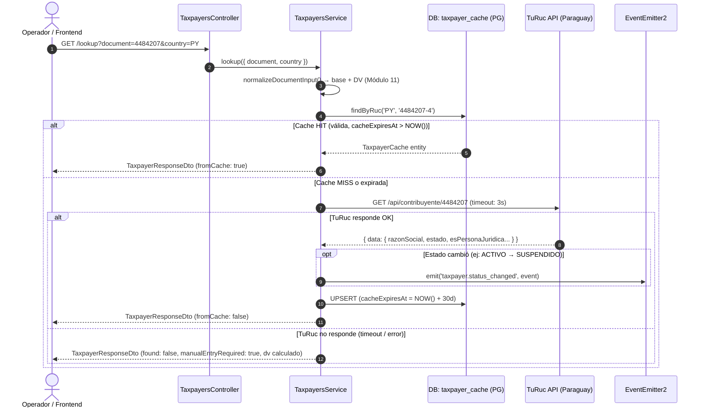
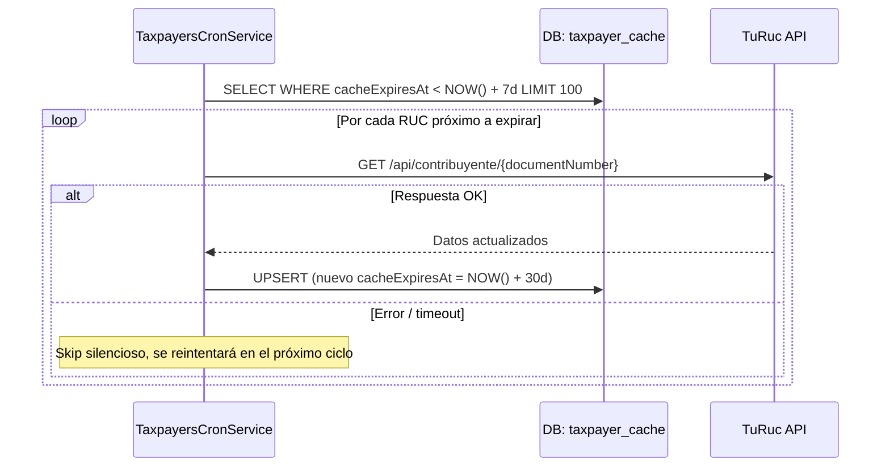

# RFC 014: Módulo de Consulta y Autocompletado Tributario (Taxpayers Lookup)

- **Estado:** Implementado ✅
- **Fecha:** 2026-08-19
- **Revisión:** v2.0 — Estrategia TuRuc + Caché Local PostgreSQL
- **Autor:** Principal Software Architect & Tech Lead
- **Módulo Destino:** `src/taxpayers/` (`TaxpayersModule`)
- **Módulos Relacionados:** `src/clients/` (`ClientsModule`), `src/companies/` (`CompaniesModule`)
- **Infraestructura Objetivo:** Linode VPS 2GB RAM, CentOS 7, PostgreSQL, NestJS (PM2)

---

## 1. Resumen Ejecutivo

El módulo permite que desde el Frontend se ingrese un documento (RUC/Cédula) y el sistema autocomplete automáticamente los datos fiscales del contribuyente. La fuente de datos para Paraguay es la API pública de **TuRuc** (`https://turuc.com.py/api`), que indexa el padrón oficial de la DNIT.

### Decisiones Arquitectónicas Clave (v2.0)

| Decisión | Alternativa Descartada | Razón |
|:---|:---|:---|
| **TuRuc API como proveedor PY** | Padrón offline (archivo .txt/.zip) | La DNIT eliminó la descarga masiva del portal. TuRuc es un servicio estable, gratuito, sin API key, basado en datos oficiales de la DNIT. |
| **Caché local PostgreSQL (TTL 7 días)** | Consultar TuRuc en cada request | Reduce latencia (<2ms vs ~300ms) y resiliencia (funciona aunque TuRuc tenga downtime). |
| **Sin `taxpayer_directory` para PY** | FTS sobre padrón local | Sin archivo masivo descargable, el directorio offline no aplica. La búsqueda por nombre usa la caché ya poblada. |
| **Caché global (multi-tenant compartida)** | Caché por empresa | Maximiza hit-rate. El aislamiento de datos del cliente está en `ClientsModule`. |

### Soporte Multi-País

El patrón `TaxpayerProviderFactory` permite agregar nuevos países (ej. AR, BR) sin modificar el código de negocio existente — solo se agrega un nuevo `Provider` y se registra en la factory.

---

## 2. Arquitectura y Flujo de Consulta

### Flujo Principal (`GET /api/v1/taxpayers/lookup`)



### Flujo del Cron de Refresco Proactivo (Mensual — 1er día del mes a medianoche)



---

## 3. Estructura del Módulo (`src/taxpayers/`)

```
src/taxpayers/
├── taxpayers.module.ts
├── taxpayers.controller.ts                  ← @Controller('taxpayers') — prefijo api/v1 global
├── taxpayers.controller.spec.ts
├── taxpayers.service.ts                     ← Orquestación: Cache → TuRuc → Eventos
├── taxpayers.service.spec.ts
├── taxpayers.cron.service.ts               ← Refresco proactivo 2:00 AM
├── taxpayers.cron.service.spec.ts
├── taxpayers.directory.service.ts          ← Búsqueda FTS en caché local
├── taxpayers.directory.service.spec.ts
│
├── constants/
│   ├── taxpayers-enums.ts                  ← TaxpayerType, TaxpayerStatus
│   ├── taxpayers-events.enum.ts            ← STATUS_CHANGED
│   └── taxpayers.tokens.ts                 ← Tokens DI
│
├── decorators/
│   └── taxpayers-swagger.decorators.ts
│
├── dto/
│   ├── lookup-taxpayer.dto.ts
│   ├── search-taxpayer.dto.ts              ← Extends BasePaginationDto
│   ├── validate-dv.dto.ts
│   ├── taxpayer-response.dto.ts
│   └── index.ts
│
├── entities/
│   └── taxpayer-cache.entity.ts            ← Única tabla de persistencia
│
├── interfaces/
│   ├── i-taxpayer-provider.interface.ts    ← Contrato multi-país
│   └── i-taxpayers-repository.interface.ts
│
├── providers/
│   ├── provider.factory.ts                 ← Selector por countryCode
│   ├── provider.factory.spec.ts
│   ├── py-dnit-public.provider.ts          ← Conecta a TuRuc API (Paraguay)
│   └── py-dnit-public.provider.spec.ts
│
├── repositories/
│   ├── taxpayer-cache.repository.ts        ← findByRuc, upsert, findExpiredRecords
│   ├── taxpayer-cache.repository.spec.ts
│   ├── taxpayer-directory.repository.ts    ← searchByName FTS sobre caché
│   └── taxpayer-directory.repository.spec.ts
│
└── utils/
    ├── py-modulo11.util.ts                 ← Cálculo DV Paraguay
    ├── py-modulo11.util.spec.ts
    ├── py-dnit-normalizer.util.ts          ← Normalización de estado DNIT
    └── py-dnit-normalizer.util.spec.ts
```

> [!NOTE]
> La tabla `taxpayer_directory` se mantiene en el código por compatibilidad y para soportar importaciones futuras si la DNIT vuelve a publicar el archivo. La estrategia de búsqueda principal (Opción 1) usa `taxpayer_cache`.

---

## 4. Esquema de Base de Datos

### Tabla `taxpayer_cache` — Única tabla activa

Almacena cada RUC consultado. El campo `rawData` (JSONB) guarda la respuesta completa de TuRuc para trazabilidad.

```
taxpayer_cache
├── id            UUID PK
├── countryCode   VARCHAR(2)     INDEXED
├── documentNumber VARCHAR(20)   INDEXED
├── dv            VARCHAR(2)
├── ruc           VARCHAR(25)    UNIQUE (countryCode, ruc)
├── businessName  VARCHAR(255)   GIN index (pg_trgm)
├── firstName     VARCHAR(150)   nullable
├── lastName      VARCHAR(150)   nullable
├── taxpayerType  VARCHAR(30)    — PERSONA_FISICA / PERSONA_JURIDICA
├── status        VARCHAR(30)    — ACTIVO / SUSPENDIDO / CANCELADO / BLOQUEADO
├── address       VARCHAR(255)   nullable
├── city          VARCHAR(100)   nullable
├── cacheExpiresAt TIMESTAMPTZ  INDEXED  — NOW() + 30 days
├── rawData       JSONB          nullable — respuesta raw de TuRuc
├── createdAt     TIMESTAMPTZ
└── updatedAt     TIMESTAMPTZ
```

---

## 5. Proveedor Paraguay: `PyDnitPublicProvider` → TuRuc API

### Endpoint

```
GET https://turuc.com.py/api/contribuyente/{rucBase}
```

- **Sin autenticación** — No requiere API Key ni registro.
- **Timeout:** 3000ms (configurado en `HttpModule.register()`).
- **Respuesta exitosa:**

```json
{
  "data": {
    "doc": 4484207,
    "razonSocial": "GARCIA SANCHEZ JUAN CARLOS",
    "dv": 4,
    "ruc": "4484207-4",
    "estado": "ACTIVO",
    "esPersonaJuridica": false,
    "esEntidadPublica": false
  },
  "message": "OK"
}
```

### Mapeo a `ITaxpayerExternalData`

| Campo TuRuc | Campo Interno | Transformación |
|:---|:---|:---|
| `razonSocial` | `businessName` | Directo |
| `esPersonaJuridica` | `taxpayerType` | `true` → `PERSONA_JURIDICA`, `false` → `PERSONA_FISICA` |
| `estado` | `status` | `normalizeDnitStatus()` → enum `TaxpayerStatus` |
| `dv` | `dv` | Convertido a string |
| `ruc` | `ruc` | Directo (ya tiene formato `base-dv`) |

> [!IMPORTANT]
> TuRuc no retorna dirección, teléfono ni email. Los campos `address`, `city`, `phone`, `email` quedan `null` en la caché. Si en el futuro se requieren estos datos, se puede complementar con la API extendida de TuRuc para personas jurídicas (`/api/contribuyente/persona-juridica?ruc={ruc}`).

---

## 6. Estrategia de Caché

```
┌─────────────────────────────────────────────────────┐
│                    Capa de Caché                    │
├──────────────┬──────────────────────────────────────┤
│ TTL          │ 30 días desde última actualización   │
│ Invalidación │ Automática (TTL) + Cron mensual       │
│ Cron         │ 1er día del mes (00:00) — batch 100  │
│ Upsert       │ ON CONFLICT (countryCode, ruc) UPDATE │
│ Búsqueda     │ businessName ILIKE + similarity()     │
└──────────────┴──────────────────────────────────────┘
```

**Flujo de decisión de la caché:**
1. `findByRuc(countryCode, ruc)` → ¿Existe y `cacheExpiresAt > NOW()`?
   - **SÍ** → Retorna de PG, `fromCache: true`.
   - **NO** → Consulta TuRuc, hace UPSERT en PG, retorna datos frescos, `fromCache: false`.
2. Si TuRuc falla (timeout/error) → Retorna `{ found: false, manualEntryRequired: true }`.

---

## 7. Contrato de API REST

| Método | Ruta | Descripción |
|:---|:---|:---|
| `GET` | `/api/v1/taxpayers/lookup` | Busca en caché → TuRuc → fallback manual. Parámetros: `document`, `country` (opt, default `PY`) |
| `GET` | `/api/v1/taxpayers/validate-dv` | Cálculo offline del Dígito Verificador Módulo 11. Sin llamadas externas. Parámetros: `document`, `country` |
| `GET` | `/api/v1/taxpayers/search` | Búsqueda por nombre/razón social sobre `taxpayer_cache` (trigram FTS). Parámetros: `q`, `search`, `limit`, `page`, `country` |

### Ejemplo de Respuesta `lookup` (éxito)

```json
{
  "found": true,
  "documentNumber": "4484207",
  "dv": "4",
  "ruc": "4484207-4",
  "businessName": "GARCIA SANCHEZ JUAN CARLOS",
  "taxpayerType": "PERSONA_FISICA",
  "status": "ACTIVO",
  "address": null,
  "city": null,
  "fromCache": false,
  "manualEntryRequired": false,
  "lastSyncedAt": "2026-08-19T19:01:37.000Z"
}
```

### Ejemplo de Respuesta `lookup` (fallback — no encontrado o error externo)

```json
{
  "found": false,
  "documentNumber": "99999999",
  "dv": "3",
  "ruc": "99999999-3",
  "fromCache": false,
  "manualEntryRequired": true
}
```

---

## 8. Eventos de Dominio

El evento `taxpayer.status_changed` se emite via `EventEmitter2` cuando el cron (o una consulta directa) detecta que el `status` en TuRuc difiere del cacheado.

```typescript
export enum TaxpayerEvents {
  STATUS_CHANGED = 'taxpayer.status_changed',
}

export interface TaxpayerStatusChangedEvent {
  countryCode: string;
  ruc: string;
  oldStatus: string;
  newStatus: string;
  detectedAt: Date;
}
```

Casos de uso: alertar al `ClientsModule` si un cliente asociado cambia a `SUSPENDIDO` o `CANCELADO`.

---

## 9. Seguridad y Rendimiento

- **Autenticación:** Todos los endpoints requieren `JwtAuthGuard + RolesGuard` (`ADMIN`, `MANAGER`, `USER`).
- **Timeout externo:** 3000ms estrictos en `HttpModule` — no bloquea el loop si TuRuc está caído.
- **Cron optimizado para VPS 2GB:** Máximo `LIMIT 100` registros por ciclo, corriendo a las 2:00 AM (baja demanda).
- **Índice GIN (pg_trgm):** Habilitado sobre `businessName` para búsquedas trigram eficientes.
- **Fallback silencioso:** Cualquier error externo es capturado en `try/catch` — el sistema nunca lanza 500 al frontend.

---

## 10. Guía de Extensión para Nuevos Países

Para agregar un nuevo país (ej. Argentina):

1. **Crear provider:** `src/taxpayers/providers/ar-afip.provider.ts` implementando `ITaxpayerProvider`.
2. **Registrar en factory:** Agregar `case 'AR': return this.arAfipProvider;` en `TaxpayerProviderFactory`.
3. **Registrar en módulo:** Agregar `ArAfipProvider` al array `providers` en `TaxpayersModule`.
4. Sin cambios en servicios, controladores ni DTOs.
