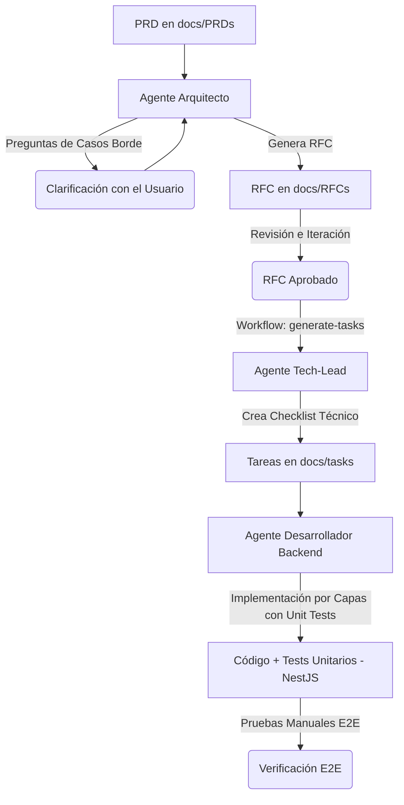

# Guía de Uso del Ecosistema de Agentes de IA (Harmonia)

Esta guía documenta el flujo de trabajo centralizado para el desarrollo de software en el proyecto **Harmonia** utilizando nuestro ecosistema de dos agentes especializados en IA:
1. **Agente Arquitecto y Technical Lead** (`.agents/rules/architect-tech-lead.md`)
2. **Agente Desarrollador Backend Experto** (`.agents/rules/backend-expert.md`)

*Nota: Los System Prompts y Workflows de los agentes están configurados en inglés para optimizar el consumo de tokens y mejorar el rendimiento del modelo, pero puedes interactuar con ellos completamente en español.*

---

## 🔄 El Ciclo de Desarrollo Extremo a Extremo (E2E)

El flujo de trabajo óptimo sigue una metodología estructurada en tres grandes etapas: **Diseño Técnico (RFC)**, **Desglose de Tareas (Tickets)** y **Construcción de Software (Desarrollo)**.

---

## 🟢 Etapa 1: Diseño Técnico con el Agente Arquitecto

El objetivo de esta etapa es procesar un documento de requerimientos de producto (PRD) y transformarlo en una especificación técnica de arquitectura detallada (RFC) libre de ambigüedades.

### Paso 1.1: Ingesta del PRD (Kickoff)
Cuando tengas un PRD listo en tu carpeta `docs/PRDs/` (o si copias el texto del PRD), inicia la conversación con el **Agente Arquitecto** adjuntando el archivo y enviando el siguiente mensaje:

> **Mensaje de Soporte:**
> *"Here is the PRD for the new [Nombre del Módulo] module. Please read it carefully. **Do not start designing the RFC yet**. First, ask me any technical questions you consider necessary about edge cases, concurrency, or business rules that are not clear in the document for this NestJS backend."*

### Paso 1.2: Resolución de Dudas (Q&A)
El agente te devolverá una lista de preguntas críticas sobre aspectos que el PRD no contemplaba (ej. qué hacer ante fallas de APIs externas, cómo estructurar logs, límites de tasa).
- **Acción:** Responde detalladamente a cada una de sus preguntas en el chat.
- Una vez respondidas, dile: *"All my answers are above. Now, please generate the Technical RFC draft in a new markdown file inside `docs/RFCs/` following your required system prompt structure."*

### Paso 1.3: Revisión y Aprobación del RFC
El Arquitecto generará un RFC en `docs/RFCs/` (por ejemplo, `003-notificaciones-whatsapp.md`) con diagramas de flujo en Mermaid, entidades TypeORM, endpoints REST y DTOs.
- Revisa el archivo propuesto. Si requieres cambios (ej. *"I want you to use NestJS Events instead of synchronous HTTP calls"*), pídelo directamente.
- Cuando estés conforme con el diseño técnico final, aprueba el RFC.

---

## 🟡 Etapa 2: Desglose de Tareas Técnico (Handoff)

Una vez que el RFC está aprobado, el **Agente Tech-Lead** debe traducir ese diseño a un plan detallado de tareas ordenado secuencialmente en base a **Clean Architecture**.

### Paso 2.1: Disparar el Workflow de Tareas
Inicia la conversación para la creación de tareas con el Agente Tech-Lead pidiéndole ejecutar el workflow [generate-tasks.md](file:///c:/Users/fedel/NestJs/vyma_backend/.agents/workflows/generate-tasks.md):

> **Mensaje de Soporte:**
> *"The RFC is approved. Please follow the `.agents/workflows/generate-tasks.md` workflow to generate the structured and sequential checklist of tasks for the developer. Save the output in a new file inside `docs/tasks/XXX-feature-tasks.md`."*

### Paso 2.2: Contrato de Desarrollo Listo
El agente creará un archivo específico dentro de `docs/tasks/` (ej. `003-notificaciones-whatsapp-tasks.md`) usando la plantilla base definida en `docs/tasks/TEMPLATE.md`.
Este archivo funcionará como el "contrato de trabajo" exacto y por capas que el desarrollador seguirá ciegamente.

---

## 🔵 Etapa 3: Implementación con el Agente Desarrollador Backend

Con el archivo de tareas generado en `docs/tasks/`, entra en juego el **Agente Desarrollador Backend Experto** (`.agents/rules/backend-expert.md`).

### Paso 3.1: Kickoff del Desarrollo
Entrega el archivo de tareas al Desarrollador para que comience:

> **Mensaje de Soporte:**
> *"Here are the tasks in `docs/tasks/XXX-feature-tasks.md` for implementing [Nombre del Módulo]. Please review them and, before writing the code, briefly list the files you are going to modify or create."*

### Paso 3.2: Construcción por Capas (Clean Architecture Auto-testeada)
El Desarrollador irá completando el checklist técnico de forma secuencial de adentro hacia afuera, **desarrollando y validando las pruebas unitarias en cada fase**. Esto facilita la creación de **Pull Requests (PRs) independientes por capa**:

1. **Persistencia:** Entidades TypeORM y migración de base de datos SQL. (Listos para PR de Base de Datos).
2. **Dominio:** Interfaces de repositorios, lógica de negocio en servicios (`.service.ts`) **y sus respectivas pruebas unitarias** (`.service.spec.ts`). (Listos para PR de Lógica de Negocio, totalmente testeado en aislamiento).
3. **Controladores e Integración (API):** Creación de DTOs validados con `class-validator`, controladores REST (`.controller.ts`) **y sus respectivas pruebas unitarias** (`.controller.spec.ts`). (Listos para PR de API).
4. **Listeners:** Consumidores de eventos asíncronos para tareas secundarias **y sus pruebas unitarias** (`.listener.spec.ts`). (Listos para PR de Integraciones/Eventos).
5. **Verificación E2E:** Pruebas de integración manuales de los endpoints usando Postman/cURL y comprobación final en PostgreSQL.

*Consejo: En cada capa, haz una pausa para revisar su código. Pídele correcciones si detectas código redundante o si viola los principios SOLID.*
