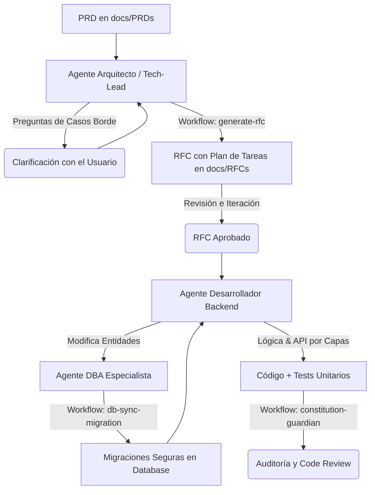

# Guía de Uso del Ecosistema de Agentes de IA (Vyma)

Esta guía documenta el flujo de trabajo centralizado para el desarrollo de software en el proyecto **Vyma** utilizando nuestro ecosistema de agentes especializados en IA:
1. **Agente Arquitecto y Technical Lead** (`.agents/rules/architect-tech-lead.md`)
2. **Agente Desarrollador Backend Experto** (`.agents/rules/backend-expert.md`)
3. **Agente Administrador de Base de Datos (DBA) Especialista** (`.agents/rules/database-administrator.md`)
4. **Agente SDET & Backend Testing Expert** (`.agents/rules/sdet-testing-expert.md`)

*Nota: Los System Prompts y Workflows de los agentes están configurados en inglés para optimizar el consumo de tokens y mejorar el rendimiento del modelo, pero puedes interactuar con ellos completamente en español.*

---

## 🔄 El Ciclo de Desarrollo Extremo a Extremo (E2E)

El flujo de trabajo óptimo sigue una metodología estructurada en tres grandes etapas: **Diseño Técnico & Tareas (RFC)**, **Construcción de Software** y **Auditoría de Calidad**.

---

## 🟢 Etapa 1: Diseño Técnico y Planificación (Tech Lead)

El objetivo de esta etapa es procesar un documento de requerimientos de producto (PRD) y transformarlo en una especificación técnica de arquitectura detallada (RFC) que incluye el plan secuencial de tareas atómicas.

### Paso 1.1: Ingesta del PRD (Kickoff)
Inicia la conversación con el **Agente Arquitecto / Tech Lead** adjuntando tu PRD en `docs/PRDs/`:
> *"Here is the PRD for the new [Nombre del Módulo] module. Please read it carefully. **Do not start designing the RFC yet**. First, ask me any technical questions you consider necessary about edge cases, concurrency, or business rules that are not clear..."*

### Paso 1.2: Resolución de Dudas (Q&A) y Generación del RFC
Responde detalladamente a las preguntas del agente y cuando todo esté claro, dile:
> *"All my answers are above. Now, please follow the `.agents/workflows/generate-rfc.md` workflow to generate the Technical RFC draft in a new markdown file inside `docs/RFCs/`."*

El agente generará el RFC bajo una estructura estricta de 5 secciones. La **Sección 5 (Sequential Implementation Plan)** contendrá el checklist granular y atómico de tareas capa por capa, actuando directamente como la lista de tareas para el programador.

Aprueba el RFC generado cuando estés conforme con el diseño propuesto.

---

## 🟡 Etapa 2: Implementación con el Agente Desarrollador Backend

Una vez aprobado el RFC, entra en juego el **Agente Desarrollador Backend Experto** (`.agents/rules/backend-expert.md`).

### Paso 2.1: Kickoff del Desarrollo
Dile al desarrollador:
> *"Here is the approved RFC in `docs/RFCs/XXX-feature-name.md` for implementing [Nombre del Módulo]. Please review the task list in Section 5 (Sequential Implementation Plan) and briefly list the files you are going to modify or create."*

### Paso 2.2: Construcción por Capas Auto-testeada
El Desarrollador debe seguir estrictamente el workflow de desarrollo `.agents/workflows/implement-feature.md` para garantizar que el código esté adecuadamente desacoplado en archivos separados, emplee inyección por constructor y siga las convenciones de nomenclatura (kebab-case). El desarrollador completará el checklist capa por capa. Al finalizar cada capa, se deben escribir y ejecutar las pruebas unitarias correspondientes. Para esta tarea, el **Agente SDET & Backend Testing Expert** intervendrá siguiendo el workflow `.agents/workflows/generate-tests.md` para garantizar el testeo de happy paths, la propagación de excepciones semánticas y el cumplimiento estricto de la cobertura mínima:
1. **Persistencia:** Entidades TypeORM y migración. Si se crean o modifican entidades, el **Agente DBA Especialista** debe intervenir siguiendo el workflow `.agents/workflows/db-sync-migration.md`.
2. **Dominio:** Interfaces y lógica en servicios (`.service.ts`) con unit tests (`.service.spec.ts`).
3. **API:** DTOs con `class-validator` y controladores con unit tests.
4. **Integraciones:** Listeners de eventos y sus unit tests.

---

## 🔵 Etapa 3: Auditoría de Calidad y Arquitectura (Code Review)

Una vez que el desarrollador finaliza (o en cualquier momento que desees verificar el estado del código), puedes ejecutar un rol de inspector implacable usando el workflow de auditoría.

### Paso 3.1: Ejecutar la Auditoría
Inicia una conversación (preferiblemente con el **Agente Arquitecto / Code Reviewer**) pidiéndole que evalúe tu código bajo el workflow de auditoría:

> **Mensaje de Soporte:**
> *"I have just finished the implementation of [Nombre del Módulo] and ran `npm run lint` and `npm run test:cov`. Here are the outputs. Please follow the `.agents/workflows/constitution-guardian.md` workflow to perform a rigorous architectural and clean code inspection of the modified files."*

### Paso 3.2: Acción del Inspector
El agente:
1. Revisará que el test coverage sea de **mínimo 80%**. Si es menor, te dará las tareas para crear los tests faltantes.
2. Validará si hay violaciones de **Clean Architecture** (ej. controladores con lógica de negocio).
3. Buscará **N+1 queries** u otros problemas de TypeORM.
4. Te devolverá un **Reporte de Auditoría** estructurado con sugerencias, snippets de corrección y un plan de acción (*Action Plan*) que puedes pasarle al Agente Desarrollador para que aplique los arreglos finales antes del Merge o PR.
