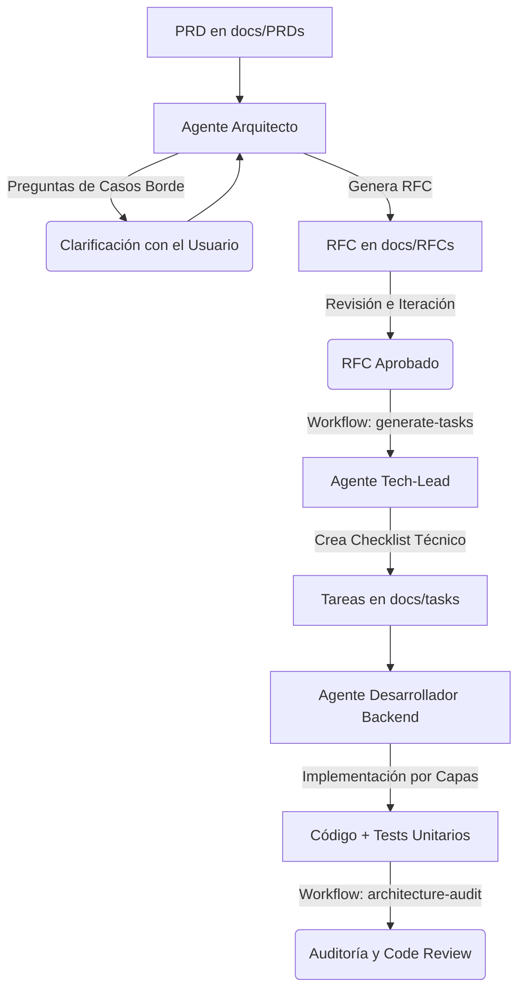

# Guía de Uso del Ecosistema de Agentes de IA (Vyma)

Esta guía documenta el flujo de trabajo centralizado para el desarrollo de software en el proyecto **Vyma** utilizando nuestro ecosistema de dos agentes especializados en IA:
1. **Agente Arquitecto y Technical Lead** (`.agents/rules/architect-tech-lead.md`)
2. **Agente Desarrollador Backend Experto** (`.agents/rules/backend-expert.md`)

*Nota: Los System Prompts y Workflows de los agentes están configurados en inglés para optimizar el consumo de tokens y mejorar el rendimiento del modelo, pero puedes interactuar con ellos completamente en español.*

---

## 🔄 El Ciclo de Desarrollo Extremo a Extremo (E2E)

El flujo de trabajo óptimo sigue una metodología estructurada en grandes etapas: **Diseño Técnico (RFC)**, **Desglose de Tareas**, **Construcción de Software** y **Auditoría de Calidad**.

---

## 🟢 Etapa 1: Diseño Técnico con el Agente Arquitecto

El objetivo de esta etapa es procesar un documento de requerimientos de producto (PRD) y transformarlo en una especificación técnica de arquitectura detallada (RFC).

### Paso 1.1: Ingesta del PRD (Kickoff)
Inicia la conversación con el **Agente Arquitecto** adjuntando tu PRD en `docs/PRDs/`:
> *"Here is the PRD for the new [Nombre del Módulo] module. Please read it carefully. **Do not start designing the RFC yet**. First, ask me any technical questions you consider necessary about edge cases, concurrency, or business rules that are not clear..."*

### Paso 1.2: Resolución de Dudas (Q&A) y Aprobación
Responde detalladamente a las preguntas del agente y cuando todo esté claro, dile:
> *"All my answers are above. Now, please generate the Technical RFC draft in a new markdown file inside `docs/RFCs/` following your required system prompt structure."*

Aprueba el RFC generado cuando estés conforme con el diseño propuesto.

---

## 🟡 Etapa 2: Desglose de Tareas Técnico (Handoff)

Una vez aprobado el RFC, el **Agente Tech-Lead** debe traducir ese diseño a un plan detallado de tareas ordenado secuencialmente en base a **Clean Architecture**.

### Paso 2.1: Disparar el Workflow de Tareas
> *"The RFC is approved. Please follow the `.agents/workflows/generate-tasks.md` workflow to generate the structured and sequential checklist of tasks for the developer. Save the output in `docs/tasks/XXX-feature-tasks.md`."*

El archivo resultante (`docs/tasks/...`) funcionará como el "contrato de trabajo" auto-testeado que el desarrollador seguirá ciegamente.

---

## 🔵 Etapa 3: Implementación con el Agente Desarrollador Backend

Con el archivo de tareas en mano, entra en juego el **Agente Desarrollador Backend Experto** (`.agents/rules/backend-expert.md`).

### Paso 3.1: Kickoff del Desarrollo
> *"Here are the tasks in `docs/tasks/XXX-feature-tasks.md` for implementing [Nombre del Módulo]. Please review them and briefly list the files you are going to modify or create."*

### Paso 3.2: Construcción por Capas Auto-testeada
El Desarrollador completará el checklist capa por capa. Al finalizar cada capa, escribirá y pasará las pruebas unitarias:
1. **Persistencia:** Entidades TypeORM y migración.
2. **Dominio:** Interfaces y lógica en servicios (`.service.ts`) con unit tests (`.service.spec.ts`).
3. **API:** DTOs con `class-validator` y controladores con unit tests.
4. **Integraciones:** Listeners de eventos y sus unit tests.

---

## 🟣 Etapa 4: Auditoría de Calidad y Arquitectura (Code Review)

Una vez que el desarrollador finaliza (o en cualquier momento que desees verificar el estado del código), puedes ejecutar un rol de inspector implacable usando el workflow de auditoría.

### Paso 4.1: Ejecutar la Auditoría
Inicia una conversación (preferiblemente con el **Agente Arquitecto**) pidiéndole que evalúe tu código bajo el workflow de auditoría:

> **Mensaje de Soporte:**
> *"I have just finished the implementation of [Nombre del Módulo] and ran `npm run lint` and `npm run test:cov`. Here are the outputs. Please follow the `.agents/workflows/architecture-audit.md` workflow to perform a rigorous architectural and clean code inspection of the modified files."*

### Paso 4.2: Acción del Inspector
El agente:
1. Revisará que el test coverage sea de **mínimo 80%**. Si es menor, te dará las tareas para crear los tests faltantes.
2. Validará si hay violaciones de **Clean Architecture** (ej. controladores con lógica de negocio).
3. Buscará **N+1 queries** u otros problemas de TypeORM.
4. Te devolverá un **Reporte de Auditoría** estructurado con sugerencias, snippets de corrección y un plan de acción (*Action Plan*) que puedes pasarle al Agente Desarrollador para que aplique los arreglos finales antes del Merge o PR.
