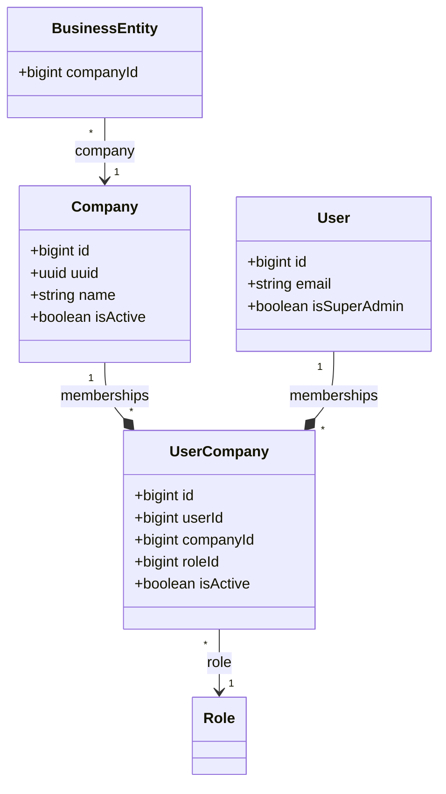

# Resumen Ejecutivo: Arquitectura Multi-Tenant

Este documento detalla el propósito de negocio, la arquitectura técnica y el comportamiento del soporte multi-tenant en el sistema.

---

## 1. Estrategia de Multi-Tenancy

El sistema adopta una estrategia de **Base de Datos Única con Aislamiento por Fila** (`companyId`), justificada por las siguientes razones:
* **Escala Estimada:** Se proyecta un máximo de 5 empresas (tenants), lo que hace innecesario y costoso operar múltiples bases de datos o esquemas dinámicos.
* **Simplicidad Operativa:** Se evita la gestión dinámica de conexiones en tiempo de ejecución.
* **Migraciones Centralizadas:** Las actualizaciones de esquema se aplican una sola vez para todas las empresas de manera atómica.
* **Ahorro de Infraestructura:** Se utiliza una única instancia de base de datos relacional (PostgreSQL).

---

## 2. Modelo de Datos y Relaciones

El aislamiento por fila se estructura en la base de datos a través de tres componentes principales:



### 2.1 Entidades de Aislamiento (Core)
*   **Empresa (`Company`):** Representa al inquilino (tenant). Cada empresa posee un identificador interno (`id`), un identificador público (`uuid`) y metadatos básicos de contacto.
*   **Membresía (`UserCompany`):** Entidad pivot Many-to-Many que vincula a un `User` con una `Company`. Contiene la propiedad clave `roleId` que define el rol específico que dicho usuario tiene dentro de esa empresa.

### 2.2 Entidades de Negocio (Tenant-Scoped)
Todas las entidades que contienen información transaccional o de negocio se asocian de forma obligatoria a una empresa mediante una columna `companyId` (índice y FK `NOT NULL` con borrado en cascada):
*   `News` (Noticias)
*   `Schedule` (Agendas)
*   `ScheduleBreak` (Bloqueos/Recesos de agenda)
*   `Service` (Servicios prestados)
*   `Profession` (Profesiones/Especialidades)

*Nota: Los módulos de `auth`, `users`, `roles` y `permissions` no están vinculados a `Company` directamente, ya que las identidades y los roles se definen de forma global.*

---

## 3. Flujo de Autenticación y Selección de Contexto

El login de la plataforma permite a un mismo usuario pertenecer a múltiples empresas con diferentes roles. El flujo de autenticación implementa la siguiente lógica:

1.  **Inicio de Sesión (`POST /auth/login`):**
    *   Se validan las credenciales globales del usuario (email y contraseña).
    *   Se consultan las membresías activas del usuario en `user_companies`.
    *   **Caso A (1 Empresa):** Si el usuario pertenece a una única empresa, se emite directamente el token de acceso (`accessToken`) y de refresco (`refreshToken`). El token contiene el contexto de esa empresa.
    *   **Caso B (Múltiples Empresas):** Si el usuario tiene membresías en 2 o más empresas, el backend devuelve un estado especial: `{ requiresCompanySelection: true, selectionToken }` junto con el listado de empresas asociadas. El `selectionToken` es un JWT temporal (expira en 5 minutos) y no contiene privilegios de acceso a recursos.
2.  **Selección de Empresa (`POST /auth/select-company`):**
    *   El cliente envía el `selectionToken` (cabecera Bearer) y el `companyUuid` seleccionado en el cuerpo de la petición.
    *   El backend valida el token, verifica que la membresía del usuario esté activa para la empresa seleccionada y emite el par definitivo de tokens con el contexto de la empresa elegida.

### Payload del JWT (Contexto Activo)
Una vez que el usuario está autenticado en un contexto activo, su `accessToken` contiene:
*   `sub`: ID del usuario (`id`).
*   `uuid`: UUID público del usuario.
*   `email`: Email del usuario.
*   `role`: El rol asignado a este usuario en la empresa activa (leído desde la membresía en `UserCompany`).
*   `companyId`: ID interno de la empresa activa.
*   `companyUuid`: UUID público de la empresa activa.
*   `isSuperAdmin`: Flag booleano de acceso irrestricto.

---

## 4. Aislamiento y Seguridad (Mecanismo del TenantGuard)

Para evitar fugas de datos entre empresas (Cross-Tenant Data Leaks), el sistema cuenta con dos líneas de defensa:

### 4.1 Primera Línea: `TenantGuard`
Se aplica en los controladores de recursos de negocio sensibles a la empresa (después de `JwtAuthGuard`):
1.  Extrae los datos de `req.user` inyectados por la estrategia JWT.
2.  Si el usuario posee el flag `isSuperAdmin` en `true`, se concede el acceso directamente (bypass).
3.  Si no es superadmin, consulta al repositorio `UserCompanyRepository` si existe una membresía activa para la combinación de `userId` y `companyId` provenientes del token.
4.  Si no existe o está inactiva, se interrumpe el flujo y se lanza una excepción de acceso prohibido (`403 Forbidden: Access to this company is not allowed`).

### 4.2 Segunda Línea: Filtrado Obligatorio en Base de Datos
Todos los métodos de los servicios y repositorios de negocio reciben de forma explícita el parámetro `companyId` del usuario autenticado (extraído del token y nunca del cuerpo del request del cliente) y lo aplican en la cláusula `WHERE` de cada consulta:
```typescript
// Ejemplo en repositorio
async findAllByCompany(companyId: number): Promise<News[]> {
  return this.repository.find({
    where: { companyId }
  });
}
```

---

## 5. El Rol de SuperAdmin

El flag `isSuperAdmin: boolean` ubicado en la entidad `User` permite gestionar la plataforma a nivel global:
*   **Bypass de Aislamiento:** El `TenantGuard` le permite el acceso a cualquier recurso de cualquier empresa sin requerir una membresía explícita en `user_companies`.
*   **Gestión de Empresas:** Solo los usuarios identificados como `isSuperAdmin` pueden crear (`POST /companies`), listar todas (`GET /companies`) y actualizar los datos maestros de las empresas (`PATCH /companies/:uuid`).
